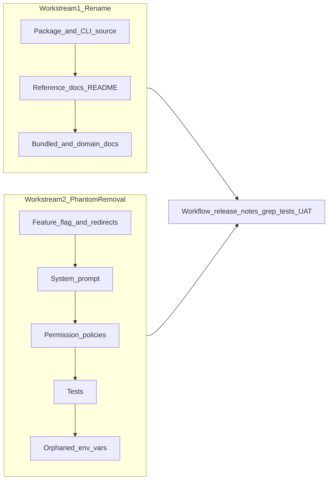

---
todos:
  - id: "phase1-rename"
    content: "Rename apps/cli package/bin and update CLI help/usage strings in index.ts + bun.lock"
    status: pending
  - id: "phase2-docs-readme"
    content: "Update docs/reference/cli.md, index.md, README.md, and scripts/migrations grep outliers"
    status: pending
  - id: "phase3-bundled-docs"
    content: "Rename/rewrite kata-agents-cli.md, update docs/index.ts and 5 domain docs"
    status: pending
  - id: "phase4-flag-redirects"
    content: "Remove kataAgentsCli flag, pre-tool-use redirects, permissions-config special-case, system prompt block"
    status: pending
  - id: "phase5-policies"
    content: "Slim cli-domains.ts, rewrite invoke bash patterns, sync default.json, update sync test"
    status: pending
  - id: "phase6-tests"
    content: "Update/remove 6 phantom-asserting test files; run packages/shared tests"
    status: pending
  - id: "phase7-env-vars"
    content: "Remove orphaned KATA_COMMANDS/CLI_* env vars from electron main"
    status: pending
  - id: "phase8-closeout"
    content: "Fix release.yml comment, append release notes, run grep gates, typecheck, UAT demo evidence"
    status: pending
isProject: false
---
# CLI rename and phantom removal — implementation plan

Spec: [docs/specs/2026-06-24-cli-rename-and-phantom-removal-design.md](docs/specs/2026-06-24-cli-rename-and-phantom-removal-design.md) (approved; backlog [#4](https://github.com/gannonh/kata-agents/issues/4) already filed).

Two workstreams ship together; closeout runs grep gates, tests, and UAT demo.



## Build-time decisions (resolved for implementer)

| Decision | Recommendation | Rationale |
|----------|----------------|-----------|
| Bash pattern sync | **Keep** sync script + test; rewrite patterns to `kata-agents-cli invoke <channel>` | Preserves Explore-mode read-only CLI allowance using the real binary; [default.json](apps/electron/resources/permissions/default.json) already depends on generated patterns |
| `cli-domains.ts` shape | **Slim** to path-scope metadata only (`workspacePathScopes`, `bashGuardPaths`, namespace) | Phantom `helpCommand` / `readActions` / `quickExamples` have no `invoke` equivalent; path scopes remain useful ownership metadata |
| Redirect functions | **Delete entirely** (`getConfigCliRedirect`, `getConfigDomainBashRedirect`, `buildCliDomainBlockMessage`) | Flag defaults off today; redirects pointed at non-existent binary; spec requires full removal |
| Path-scope exports | **Keep** `KATA_AGENTS_CLI_*_SCOPE_*` constants even if temporarily unused | Low-cost canonical metadata; avoids re-deriving scopes when a future commands CLI lands |
| Flag-only tests | **Delete** [pi-agent-pretool-labels.test.ts](packages/shared/src/agent/__tests__/pi-agent-pretool-labels.test.ts) and [permissions-config-kata-cli-flag.test.ts](packages/shared/src/agent/__tests__/permissions-config-kata-cli-flag.test.ts) | No behavior left to test |
| Migration script | **Update** [brand-transition-migrate.ts](scripts/migrations/brand-transition-migrate.ts) `kata-cli` strings → `kata-agents-cli` | Included in `kata-cli` grep gate (`scripts/` is in scope) |

**Read-only invoke allowlist** (derive from [channels.ts](packages/shared/src/protocol/channels.ts), mirroring old `readActions` intent):

- `labels:list`
- `sources:get`, `sources:getPermissions`
- `skills:get`
- `automations:get`, `automations:getHistory`, `automations:getLastExecuted`
- `workspace:getPermissions`, `permissions:getDefaults`, `workspaceSettings:get`
- `system:homeDir` (e2e AC 11f)

Emit as one or few regex rules, e.g. `^kata-agents-cli\s+invoke\s+(labels:list|sources:get|...)\b`, plus `^kata-agents-cli\s+--help\b`. Run `bun run sync:kata-agent-bash-patterns` (from [packages/shared/package.json](packages/shared/package.json)) to refresh [default.json](apps/electron/resources/permissions/default.json).

Rename generator to something truthful (e.g. `getAgentsCliReadOnlyInvokeBashPatterns`) and update sync matcher from `^kata-agent\\s` → `^kata-agents-cli\\s+invoke\\s+`.

---

## Phase 1 — Package + CLI source rename

**Files:** [apps/cli/package.json](apps/cli/package.json), [apps/cli/src/index.ts](apps/cli/src/index.ts), [apps/cli/src/server-spawner.ts](apps/cli/src/server-spawner.ts) (comments only if present)

- `name`: `@kata-sh/agents-cli`
- `bin`: `kata-agents-cli` → `src/index.ts`
- Update help header, usage line, examples (~lines 3, 1379, 1894–1953 per spec)
- Replace residual `craft-kb` / `craft-public` example source slugs with neutral Kata examples
- Run `bun install` at repo root to refresh [bun.lock](bun.lock) workspace name

**Verify:** `bun run apps/cli/src/index.ts --help` and `--version`; no `kata-cli` or `craft` in help output.

---

## Phase 2 — Reference docs + README

**Files:** [docs/reference/cli.md](docs/reference/cli.md), [docs/reference/index.md](docs/reference/index.md), [README.md](README.md)

- Retitle to `kata-agents-cli`; replace all invocations and `bun link` instructions
- Do **not** edit historical brand-transition specs/ADR (grep exclusions)

**Also fix grep outliers in scope:**
- [scripts/migrations/brand-transition-migrate.ts](scripts/migrations/brand-transition-migrate.ts) — update `kata-cli` mapping strings
- [apps/electron/resources/release-notes/0.10.7.md](apps/electron/resources/release-notes/0.10.7.md) — only if it contains `kata-cli` outside versioned historical context (grep shows 2 hits; update or confirm acceptable)

**Verify:** targeted `kata-cli` grep clean in `docs/reference/`, `README.md`, `scripts/` (excluding historical spec paths).

---

## Phase 3 — Bundled doc rename + domain docs

**Rename:** [apps/electron/resources/docs/kata-cli.md](apps/electron/resources/docs/kata-cli.md) → `kata-agents-cli.md`

**Rewrite bundled doc** to document the real terminal client:
- Connection flags (`--url`, `--token`, env vars)
- Core commands: `ping`, `workspaces`, `sessions`, `invoke`, etc.
- Config-domain access via `kata-agents-cli invoke <channel>` with examples per domain (labels, sources, skills, automations, permissions)
- **No** `kata-agent label/source/...` grammar

**Update doc registry:** [packages/shared/src/docs/index.ts](packages/shared/src/docs/index.ts)
- Change `kataCli` path to `kata-agents-cli.md` (key name can stay `kataCli` per spec; grep targets `kata-cli` hyphen form)

**Domain docs** — replace phantom canonical lines in:
- [labels.md](apps/electron/resources/docs/labels.md), [sources.md](apps/electron/resources/docs/sources.md), [skills.md](apps/electron/resources/docs/skills.md), [automations.md](apps/electron/resources/docs/automations.md), [permissions.md](apps/electron/resources/docs/permissions.md)
- Drop "CLI-first `kata-agent ...`" framing; link to `kata-agents-cli.md` invoke guidance instead

Grep for any other hardcoded `kata-cli.md` references.

---

## Phase 4 — Feature flag + gated redirect/guardrail code

**[feature-flags.ts](packages/shared/src/feature-flags.ts):** remove `isKataAgentsCliEnabled()`, `FEATURE_FLAGS.kataAgentsCli`, and `KATA_FEATURE_KATA_AGENTS_CLI` parsing.

**[pre-tool-use.ts](packages/shared/src/agent/core/pre-tool-use.ts):**
- Delete `buildCliDomainBlockMessage`, `getConfigCliRedirect`, `getConfigDomainBashRedirect`
- Remove flag branches at ~813 and ~827
- Drop unused imports from `cli-domains.ts` (`CLI_DOMAIN_POLICIES`, scope entries) if no longer referenced
- Remove `mockKataAgentsCliFlag` from [pre-tool-use-checks.isolated.ts](packages/shared/src/agent/core/__tests__/pre-tool-use-checks.isolated.ts) mock module

**[permissions-config.ts](packages/shared/src/agent/permissions-config.ts):** remove `shouldCompileBashPattern` special-case for `^kata-agent\\s` tied to flag.

**[system.ts](packages/shared/src/prompts/system.ts):** remove entire flag-gated block (doc table row + "## Kata Agent CLI" section at ~589–602). **No replacement prompt block.**

**Verify:** feature-flag grep gate returns zero matches.

---

## Phase 5 — Permission policies rewrite

**[cli-domains.ts](packages/shared/src/config/cli-domains.ts):**
- Slim `CliDomainPolicy` to `{ namespace, workspacePathScopes, bashGuardPaths? }`
- Remove `helpCommand`, `readActions`, `quickExamples` from all 6 domains
- Replace `getKataAgentReadOnlyBashPatterns()` with invoke-based generator (rename function)

**[sync-kata-agent-bash-patterns.ts](packages/shared/src/config/sync-kata-agent-bash-patterns.ts):**
- Update pattern detection filter and stdout message to new prefix
- Regenerate [default.json](apps/electron/resources/permissions/default.json)

**[permissions-kata-agent-sync.test.ts](packages/shared/tests/permissions-kata-agent-sync.test.ts):** update expected patterns to invoke form (keep invariant: default.json matches generator).

**Verify:** phantom grep gate clean in `cli-domains.ts` and sync script.

---

## Phase 6 — Phantom-asserting tests

| File | Action |
|------|--------|
| [pre-tool-use-checks.isolated.ts](packages/shared/src/agent/core/__tests__/pre-tool-use-checks.isolated.ts) | Remove `kata-agent` redirect/allowlist cases (~480–644, ~625) |
| [shellguard-corpus.test.ts](packages/shared/tests/shellguard-corpus.test.ts) | Remove Group 27 + all `kata-agent` corpus entries; add `kata-agents-cli invoke` allowlist group if needed |
| [pi-agent-pretool-labels.test.ts](packages/shared/src/agent/__tests__/pi-agent-pretool-labels.test.ts) | Delete file |
| [permissions-config-kata-cli-flag.test.ts](packages/shared/src/agent/__tests__/permissions-config-kata-cli-flag.test.ts) | Delete file |
| [feature-flags.test.ts](packages/shared/src/__tests__/feature-flags.test.ts) | Remove `kataAgentsCli` cases |

**Verify:** `cd packages/shared && bun test`

---

## Phase 7 — Orphaned env vars

**[apps/electron/src/main/index.ts](apps/electron/src/main/index.ts)** (~172–181): delete assignments for `KATA_COMMANDS_ENTRY`, `KATA_CLI_ENTRY`, `KATA_COMMANDS_DOC_PATH`, `KATA_CLI_DOC_PATH`.

**Note:** `KATA_CLI_JSON_ONLY` in [debug.ts](packages/shared/src/utils/debug.ts) is **not** in scope — keep it.

**Verify:** env-var grep gate returns zero matches.

---

## Phase 8 — Closeout (workflow, release notes, OKF, verification)

**[.github/workflows/release.yml](.github/workflows/release.yml)** `publish_cli` job (~440–467):
- Replace stale "Project B / scope rename" comment with "deferred pending product decision"
- Update disabled `echo` to reference `@kata-sh/agents-cli`

**[apps/electron/resources/release-notes/next.md](apps/electron/resources/release-notes/next.md):**
- **Improvements:** rename bullet
- **Breaking Changes:** `kata-cli` → `kata-agents-cli`; phantom `kata-agent` commands-CLI refs and `kataAgentsCli` flag removed

**OKF hygiene** (per [AGENTS.md](AGENTS.md)):
- Append build log entry under [docs/specs/](docs/specs/) or relevant `log.md`
- [docs/specs/index.md](docs/specs/index.md) already lists this spec — update status after build

**Full verification suite** (spec §Verification):

```bash
# Grep gates (apply exclusion set from spec)
grep -rn "kata-cli" apps/ docs/ packages/ scripts/ .github/ README.md  # → 0
grep -rn "kataAgentsCli\|KATA_FEATURE_KATA_AGENTS_CLI\|isKataAgentsCliEnabled" packages/ apps/  # → 0
grep -rn "KATA_COMMANDS_ENTRY\|KATA_CLI_ENTRY\|KATA_COMMANDS_DOC_PATH\|KATA_CLI_DOC_PATH\|packages/kata-cli\|packages/kata-agents-commands" .  # → 0
grep -rn "kata-agent CLI\|kata-agent label\|kata-agent source\|kata-agent skill\|kata-agent automation\|kata-agent permission\|kata-agent theme" packages/ apps/  # → 0

cd apps/cli && bun run tsc --noEmit && bun test
cd packages/shared && bun test
```

**UAT demo (AC 11)** — capture transcript + screenshots under `uat-evidence/`:
1. Non-headless `bun run electron:dev` — window opens (screenshot)
2. Headless `KATA_HEADLESS=1 bun run electron:dev` — capture `KATA_SERVER_URL` + `KATA_SERVER_TOKEN`
3. `kata-agents-cli --url ... --token ... ping`
4. `workspaces` or `sessions`
5. `session create --name "demo"` → `sessions` → `session messages <id>`
6. `invoke labels:list`
7. `invoke system:homeDir`

Use `bun run apps/cli/src/index.ts` if binary not globally linked.

---

## Out of scope (do not implement)

- Building `kata-agent` workspace-commands CLI ([#4](https://github.com/gannonh/kata-agents/issues/4))
- Enabling `publish_cli` / npm publishing
- Changing CLI command surface or `kata-server`
- Touching product-name `kata-agent` (navigation events, `~/.kata-agents`, etc.)
- Editing historical brand-transition specs/verify reports

## Risk reminders

- **Default users:** no behavior change (flag was off); flag-on users lose redirects to non-existent binary — correct outcome
- **Over-removal:** phantom grep targets CLI-command forms only, not bare `kata-agent` product identity
- **`kata-clipboard-*` temp files** in [files.ts](packages/shared/src/utils/files.ts) are unrelated to `kata-cli` grep