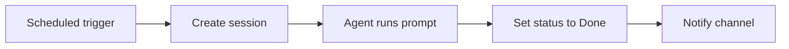

Automations let Kata Agents respond to events without you starting every session manually. They can create sessions, run prompts, call commands, and route results to messaging channels.

## Automation triggers

Common triggers include:

- schedules
- session status changes
- label add or remove events
- incoming messages from connected chat platforms
- workspace events

## What automations can do

Automations can:

- create a session from a recurring prompt
- triage incoming requests
- summarize work at the end of the day
- notify a team channel when a session is done
- run maintenance or reporting workflows

## Example workflow

## Best practices

- Keep prompts explicit and bounded.
- Use labels and statuses as automation state.
- Start with read-only workflows before allowing writes.
- Route important output to a session so there is an audit trail.
- Make automations easy to disable when debugging.
