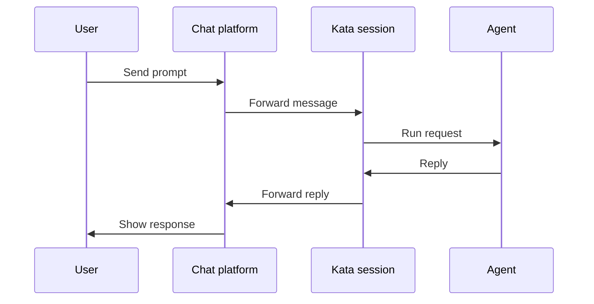

Messaging connects a Kata Agents session to an external chat platform. You can send prompts, receive replies, and coordinate work without staying in the desktop app.

## When to use messaging

Use messaging when you want to:

- monitor long-running sessions from another device
- send quick follow-up prompts while away from your desk
- route automation results to a team space
- keep a project or incident channel connected to an agent session

## How it works

A messaging channel binds to a session. Messages from the chat app are forwarded into the session, and agent replies are sent back through the same channel.

## Safety

Messaging does not bypass permission modes. The session still follows its current mode and configured rules.

<Tip>
  Pair messaging with automations for workflows like scheduled digests, status-change notifications, or remote task handoff.
</Tip>
