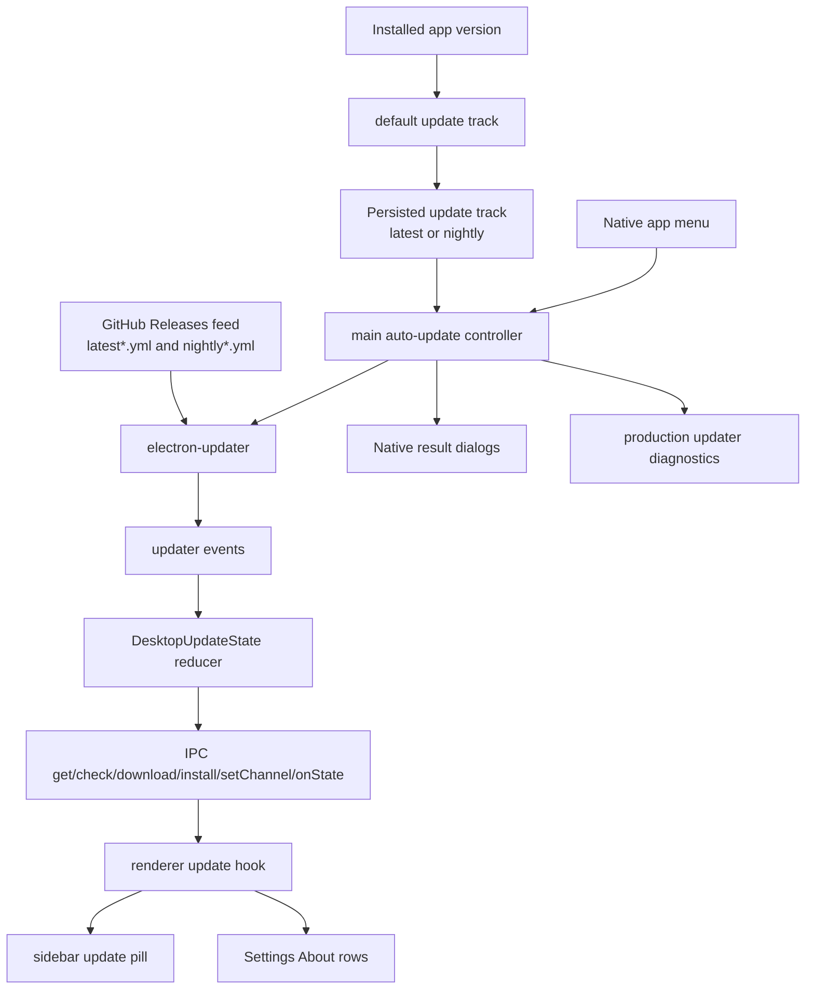

# Update UX Parity with Kata Code

## Status

- **Plan**: Approved 2026-06-20 after user alignment and adversarial review.
- **Build**: Implemented (2026-06-20). Phases 1-4 landed; Phase 5 verification
  green. See `2026-06-20-update-ux-parity-with-kata-code-build-report.md`.
  Independent subagent review was unavailable (subagent dispatch unstable);
  single-agent self-review recorded in the build report.
- **Verify**: Not started.

## Goal

Replicate the desktop update UX from Kata Code in Kata Agents on branch
`feat/update-ux-parity-with-kata-code`.

The target behavior is: packaged builds check for updates in the background,
surface an available update in the left sidebar and Settings, download only after
the user clicks the update action, and install only after the user confirms a
restart. Settings must let users choose Stable or Nightly update tracks. The app
menu must show a native result dialog when manual checks have no visible sidebar
state change.

This plan builds on Project B's GitHub Releases feed. It changes runtime UX
selection from "installed version always decides the channel" to "installed
version supplies the default channel, and a persisted user setting can override
it." It does not change release artifact or manifest semantics, and it does not
change app identity infrastructure.

## Source of truth

Reference implementation:

- `/Volumes/EVO/dev/kata-code/apps/desktop/src/updates/DesktopUpdates.ts`
- `/Volumes/EVO/dev/kata-code/apps/desktop/src/updates/updateMachine.ts`
- `/Volumes/EVO/dev/kata-code/apps/desktop/src/updates/updateChannels.ts`
- `/Volumes/EVO/dev/kata-code/apps/desktop/src/ipc/methods/updates.ts`
- `/Volumes/EVO/dev/kata-code/apps/desktop/src/window/DesktopApplicationMenu.ts`
- `/Volumes/EVO/dev/kata-code/apps/web/src/components/sidebar/SidebarUpdatePill.tsx`
- `/Volumes/EVO/dev/kata-code/apps/web/src/components/settings/SettingsPanels.tsx`
- `/Volumes/EVO/dev/kata-code/apps/web/src/components/desktopUpdate.logic.ts`
- `/Volumes/EVO/dev/kata-code/apps/web/src/lib/desktopUpdateReactQuery.ts`

Reference screenshots from the request:

- `pi-clipboard-69f8f52d-d1d8-4afb-8eaf-525809d8faf1.png`: sidebar `Update available` pill.
- `pi-clipboard-a5c058c4-bf76-40a5-9123-1bba8ecf73f2.png`: `Restart to update` pill and downloaded toast.
- `pi-clipboard-1dd4f69b-498f-4d99-b769-72495a635675.png`: persistent `Restart to update` pill.
- `orca-paste-1781994545278-527eae77-cad5-4429-b7bb-dc70809ceb3a.png`: install confirmation dialog.
- `pi-clipboard-cf46d87f-ca0a-4d02-9faf-2e87c9fb4ef2.png`: Settings About section with version, update track, and diagnostics.
- `orca-paste-1781994429241-13aa0190-d5b1-47f0-b4f1-9d9475c80c57.png`: native up-to-date dialog.
- `orca-paste-1781994388182-c0b69d7d-2797-437c-bc01-80b4f871694b.png`: current About copyright.

## Verified current state

Kata Agents currently has the release feed and basic updater wiring:

- `release.yml` publishes stable assets and `latest*.yml` manifests to GitHub Releases.
- Packaged `app-update.yml` points at `gannonh/kata-agents` with `provider: github`.
- `apps/electron/src/main/update-channel.ts` derives `latest` vs `nightly` from the installed version.
- `apps/electron/src/main/auto-update.ts` sets `autoUpdater.channel` and `allowPrerelease`, checks on launch, and auto-downloads once an update is available.
- `apps/electron/src/renderer/hooks/useUpdateChecker.ts` shows a toast when an update is ready and shows an up-to-date toast for the Settings button.
- `apps/electron/src/main/menu.ts` calls `checkForUpdates({ autoDownload: true })` from the native menu without user-visible feedback when the result is up to date.
- `apps/electron/src/main/logger.ts` disables both file and console transports in production, which makes packaged updater behavior difficult to diagnose.
- `apps/electron/src/renderer/pages/settings/AppSettingsPage.tsx` shows current version, a Check Now button, download progress, and restart button, but has no Stable/Nightly track selector.
- There is no sidebar update pill.
- The current About metadata comes from `apps/electron/electron-builder.yml` and shows `Copyright © 2026 Craft Docs Ltd.`.

## Project B delta

Project B documented runtime channel selection as installed-version driven:
nightly builds use `nightly*.yml`, and stable builds use `latest*.yml`. This
spec keeps that as the default, then adds a user preference that can override the
default from Settings.

Build must update `docs/operations/release.md` and related release docs so they
state the new runtime contract: the installed version determines the default
track, the persisted user-selected track overrides it, and release artifacts and
manifest names remain unchanged.

## Constraints

- Preserve identity infrastructure: `appId`, `craftagents://`, `~/.craft-agent`, `@craft-agent/*`, `CRAFT_*`, and auth/publish domains outside the desktop update feed remain unchanged.
- Keep the GitHub Releases update feed from Project B.
- Follow the repository's i18n rule: all user-facing strings go through translation keys present in every locale file.
- Keep changes focused on desktop update UX, updater runtime state, settings, diagnostics, docs, and tests.
- Do not enable npm publishing.
- Do not rely on hidden production behavior. The implemented feature must expose visible state and diagnostics.

## Out of scope

- Project C package/scope/env rename.
- Project D identity infrastructure migration.
- Changing release artifact names or GitHub release channel semantics.
- Windows code signing.
- Replacing `electron-updater`.
- Redesigning Settings outside the About/update rows.
- Legal cleanup beyond the specific copyright string called out below.

## Acceptance criteria

1. Packaged Electron builds run background update checks after launch and on a recurring interval, and they do not download an update until the user explicitly clicks a download action.
2. When a newer version is available, the left sidebar footer shows an `Update available` pill with a session-only dismiss affordance for that launch. The dismissed pill returns after app restart if the update is still available.
3. Clicking the `Update available` pill starts the update download; while downloading, the pill shows progress.
4. After the download completes, the sidebar pill changes to `Restart to update`; clicking it shows a confirmation dialog that warns running tasks will be interrupted, then installs and restarts after confirmation.
5. Settings -> About shows current version, update status, a context-aware update action button, and the `Update track` Stable/Nightly selector.
6. Stable follows full releases through `latest*.yml`; Nightly follows prereleases through `nightly*.yml`. The installed app version supplies the default channel, while the persisted user selection overrides that default. Switching tracks persists the choice, reconfigures the updater immediately, resets stale update state, and checks the selected channel.
7. Channel changes are blocked while an update check, download, or install is active, and the user sees an actionable error if the change cannot be applied.
8. The macOS native app menu `Check for Updates...` shows a native dialog when the app is up to date, when updates are unavailable, or when the check fails. If non-macOS builds expose the same menu action, they follow the same result contract.
9. Production builds retain updater diagnostics in a local file, expose the diagnostics path through Settings, and support opening or showing that file from the diagnostics row.
10. The copyright outcome is explicitly recorded before Build signoff: either app-facing metadata changes to `Copyright © 2026 Kata Code Contributors`, or it remains unchanged with maintainer approval. In both outcomes, existing `LICENSE` and `NOTICE` ownership notices remain preserved unless a separate legal cleanup is approved.
11. All new user-facing strings are translated through i18n keys that exist in every locale file.
12. Tests cover the pure update-state reducer, channel selection, update-track persistence, sidebar/settings action decisions, menu check result behavior, and no-auto-download-before-user-click behavior. Any omitted test category must be listed in the Build report with rationale and maintainer approval.
13. Manual verification includes a packaged stable build detecting a newer stable release or mocked stable feed, plus a nightly build or mocked nightly feed proving Nightly track behavior and switching back to Stable.

## Architecture

### Main process state model

Add a pure update state module modeled on kata-code's `updateMachine.ts`.

The state should include:

- `enabled: boolean`
- `status: 'disabled' | 'idle' | 'checking' | 'up-to-date' | 'available' | 'downloading' | 'downloaded' | 'error'`
- `channel: 'latest' | 'nightly'`
- `currentVersion: string`
- `availableVersion: string | null`
- `downloadedVersion: string | null`
- `downloadPercent: number | null`
- `checkedAt: string | null`
- `message: string | null`
- `errorContext: 'check' | 'download' | 'install' | null`
- `canRetry: boolean`
- optional runtime architecture fields if useful for parity with Kata Code's Apple Silicon warning

Use pure reducer helpers for check start, check failure, update available, no update,
download start, progress, download failure, download complete, install failure, and
channel reset. Keep these helpers free of Electron imports so they are easy to test.

### Main updater controller

Refactor `apps/electron/src/main/auto-update.ts` around explicit actions:

- `configureUpdates()` or equivalent initialization.
- `getUpdateState()`.
- `setUpdateChannel(channel)`.
- `checkForUpdate(reason)`.
- `downloadUpdate()`.
- `installUpdate()`.
- `onUpdateState` broadcast to renderer windows.

Controller behavior:

- Read the selected update channel from persisted app config. If absent, default from the installed version.
- Configure `autoUpdater.channel`, `allowPrerelease`, and `allowDowngrade` based on selected track.
- Set `autoDownload = false` and `autoInstallOnAppQuit = false`.
- Run a delayed startup check, then recurring poll checks.
- Ignore update versions that do not match the selected channel.
- Keep current pre-update window-state snapshot logic before `quitAndInstall`.
- Use explicit state transitions for every updater event.
- Broadcast each relevant state transition to all renderer windows.

### IPC and preload API

Extend the update API to match the richer contract:

- `getUpdateState(): Promise<DesktopUpdateState>`
- `setUpdateChannel(channel): Promise<DesktopUpdateState>`
- `checkForUpdate(): Promise<DesktopUpdateCheckResult>`
- `downloadUpdate(): Promise<DesktopUpdateActionResult>`
- `installUpdate(): Promise<DesktopUpdateActionResult>`
- `onUpdateState(callback): () => void`

Keep `checkForUpdates`, `getUpdateInfo`, and `onUpdateAvailable` compatibility wrappers if they reduce migration risk for existing renderer code. If wrappers add ambiguity, migrate all callsites in this spec and remove the old surface in the same change.

### Persistence

Persist the update track in the existing app config path rather than localStorage.

Recommended config fields:

- `updateChannel?: 'latest' | 'nightly'`
- `updateChannelConfiguredByUser?: boolean`

Default behavior:

- A stable build defaults to `latest`.
- A nightly build defaults to `nightly`.
- If the user changes the track, the explicit choice persists across launches.
- Switching back to the version-default channel clears or normalizes the configured flag if that matches existing config style.

### Renderer hook and shared UI logic

Replace the current `useUpdateChecker` assumptions with state-driven helpers:

- `useDesktopUpdateState()` loads `getUpdateState()` and subscribes to `onUpdateState`.
- A pure renderer logic module maps state to:
  - sidebar pill visibility
  - action: `download`, `install`, or `none`
  - disabled state
  - button label
  - tooltip
  - confirmation text
  - error toast text

This mirrors kata-code's `desktopUpdate.logic.ts` and keeps UI decisions testable.

### Sidebar update pill

Add a compact pill in the left sidebar footer, above Settings:

- Hidden when updates are disabled, idle, up to date, or dismissed for the current launch. This dismissal is renderer/session state only and does not persist across app restarts.
- Shows `Update available` with download icon and dismiss `x` when state is `available`.
- Shows `Downloading (N%)` when state is `downloading`.
- Shows `Restart to update` when state is `downloaded`.
- Clicking available/download-failed state starts download.
- Clicking downloaded/install-failed state shows a confirmation dialog and then installs.
- Download completion shows a toast: title `Update downloaded`; description `Restart the app from the update button to install it.`

### Settings About update rows

Update `apps/electron/src/renderer/pages/settings/AppSettingsPage.tsx` About section:

- Version row shows the current version and status/action button.
- The action button maps state to:
  - `Check for Updates`
  - `Checking...`
  - `Download`
  - `Downloading...`
  - `Install` or `Restart to update`
  - `Up to Date`
- Add `Update track` selector with `Stable` and `Nightly`.
- Use the exact explanatory copy approved by the user: `Stable follows full releases. Nightly follows the nightly desktop channel and can switch back to stable immediately.`
- Add a diagnostics row that displays or opens the local updater log path.

### Native menu behavior

Change native menu `Check for Updates...` to call the stateful update controller:

- If updates are disabled/unavailable, show an info dialog with the disabled reason.
- If the check result is `up-to-date`, show an info dialog: `Kata Agents <version> is currently the newest version available.`
- If the check result is `error`, show a warning dialog with the state message.
- If an update is available or downloaded, do not show a redundant dialog. The sidebar/settings state should update visibly.

### Production diagnostics

Do not leave updater diagnostics invisible in production.

Recommended implementation:

- Keep file logging enabled for production at `info` or `warn` level, with rotation.
- Ensure `[auto-update]`, `[electron-updater]`, and update install flow messages are written.
- Expose a local log path to Settings and include a diagnostics row with an open/show action.
- Keep console logging disabled in production unless existing policy says otherwise.

### Copyright

The user requested `Kata Code Contributors` if Apache allows it. Apache 2.0 allows additional copyright notices for modifications, but this repository also has existing `LICENSE` and `NOTICE` entries for Craft Docs Ltd. The build should update only app-facing metadata if approved by maintainers:

- `apps/electron/electron-builder.yml` `copyright` -> `Copyright © 2026 Kata Code Contributors`.

Do not remove Craft Docs Ltd. from `LICENSE` or `NOTICE` in this spec.

## Implementation phases

### Phase 1 - Contract and state model

- Add shared update types or extend the existing protocol DTOs for `DesktopUpdateState`, `DesktopUpdateChannel`, `DesktopUpdateCheckResult`, and `DesktopUpdateActionResult`.
- Add pure main-process reducer helpers and tests.
- Add selected-channel resolution helpers and tests.
- Add persisted config fields and tests.

Acceptance tie-in: AC 5, AC 6, AC 7, AC 12.

### Phase 2 - Main updater controller and IPC

- Refactor `auto-update.ts` to `autoDownload=false`, explicit check/download/install actions, selected-channel configuration, recurring background polling, and full state broadcasts.
- Keep pre-update window-state snapshot behavior.
- Add IPC channels/handlers/preload mappings for the richer update contract.
- Add production diagnostics and expose the log path through the update API for Settings.

Acceptance tie-in: AC 1, AC 3, AC 4, AC 6, AC 8, AC 9.

### Phase 3 - Renderer UX parity

- Add state-driven update hook and pure UI action helpers.
- Add sidebar update pill above Settings.
- Update Settings -> About with status/action button, Stable/Nightly selector, and diagnostics row.
- Update native menu check path with up-to-date, unavailable, and error dialogs.
- Add i18n keys across all locale files.

Acceptance tie-in: AC 2, AC 3, AC 4, AC 5, AC 8, AC 11.

### Phase 4 - Copyright, release notes, and docs

- Record the maintainer-approved copyright outcome. If approved, update app-facing copyright metadata to `Copyright © 2026 Kata Code Contributors`; otherwise leave it unchanged and record the approval to defer.
- Preserve `LICENSE` and `NOTICE`.
- Add a release-notes bullet to `apps/electron/resources/release-notes/next.md`.
- Update `docs/operations/release.md` and any related OKF docs/logs for the new selected-channel runtime contract after implementation.

Acceptance tie-in: AC 6, AC 10.

### Phase 5 - Verification

- Run targeted tests for update reducer/channel/persistence/UI logic.
- Run i18n validation.
- Run the Electron package typecheck.
- Manually verify a packaged stable build against a newer stable release or mocked feed.
- Manually verify Nightly track behavior with a nightly release or mocked feed.

Acceptance tie-in: AC 1 through AC 13.

## Key files

Likely changed files:

- `apps/electron/src/main/auto-update.ts`
- `apps/electron/src/main/update-channel.ts`
- `apps/electron/src/main/update-state.ts` or equivalent new file
- `apps/electron/src/main/menu.ts`
- `apps/electron/src/main/logger.ts`
- `apps/electron/src/main/handlers/system.ts`
- `apps/electron/src/transport/channel-map.ts`
- `apps/electron/src/preload/bootstrap.ts`
- `apps/electron/src/shared/types.ts`
- `packages/shared/src/protocol/channels.ts`
- `packages/shared/src/protocol/dto.ts`
- `packages/shared/src/config/storage.ts`
- `apps/electron/src/renderer/hooks/useUpdateChecker.ts` or replacement hook
- `apps/electron/src/renderer/components/app-shell/AppShell.tsx`
- new sidebar update pill component under `apps/electron/src/renderer/components/app-shell/` or `components/sidebar/`
- `apps/electron/src/renderer/pages/settings/AppSettingsPage.tsx`
- `packages/shared/src/i18n/locales/{en,de,es,hu,ja,pl,zh-Hans}.json`
- `apps/electron/electron-builder.yml`
- `apps/electron/resources/release-notes/next.md`
- relevant tests under `apps/electron/src/main/__tests__`, `apps/electron/src/renderer/**/__tests__`, and `packages/shared/src/config/__tests__`

## Risks and mitigations

- **Mixed old and new update APIs.** Mitigation: migrate renderer callsites to the stateful API in one phase, or keep wrappers only where behavior is identical.
- **Channel switch during active update action.** Mitigation: block switching while checking/downloading/installing and surface an actionable error.
- **Stable build on Nightly track may need downgrade/switch-back semantics.** Mitigation: set `allowPrerelease` for Nightly and temporarily allow downgrade during channel-change checks, following kata-code.
- **Manual feed verification can be slow because it needs a newer release.** Mitigation: allow a mocked feed for Build verification, then require maintainer UAT with real signed releases before signoff.
- **Production logs may expose sensitive data.** Mitigation: log updater metadata only: versions, channel, status, percent, and error messages from updater. Do not log secrets, tokens, or request headers.
- **Copyright wording may exceed implementation authority.** Mitigation: update only app-facing metadata and preserve existing legal files unless the maintainer separately approves legal notice changes.

## Verification plan

Commands and checks for Build/Verify:

- `bun test apps/electron/src/main/__tests__/update-channel.test.ts`
- targeted tests for the new update reducer and renderer update logic, including no `downloadUpdate()` before explicit user click
- package-level typecheck for Electron: `cd apps/electron && bun run typecheck`
- i18n checks: `bun run lint:i18n:parity` and `bun run lint:i18n:sorted`
- package a stable build and inspect `app-update.yml` for `provider: github`, `repo: kata-agents`, and stable channel behavior
- UAT packaged stable build against a newer stable release or mocked feed:
  1. launch app
  2. wait for background check
  3. confirm sidebar `Update available`
  4. click download
  5. confirm progress
  6. confirm `Restart to update`
  7. confirm restart dialog
- UAT Settings:
  1. open Settings -> About
  2. confirm version/status/action row
  3. switch Stable -> Nightly
  4. confirm immediate check and persisted selection after restart
  5. switch Nightly -> Stable
- UAT menu:
  1. install latest stable
  2. click app menu `Check for Updates...`
  3. confirm native up-to-date dialog

## Build handoff

- **Approved scope**: port Kata Code's update state machine and UX into Kata Agents, including background checks, manual download, sidebar pill, settings update track selector, native check dialogs, production updater diagnostics, explicit app-facing copyright outcome, i18n, tests, release notes, and docs updates.
- **Non-goals**: identity infra migration, npm publishing, release feed redesign, Windows signing, broad Settings redesign, removal of existing legal ownership notices.
- **Recommended sequence**: state/types/persistence -> main updater/IPC -> renderer UX/menu -> copyright/release notes -> verification.
- **Required verification**: all acceptance criteria above, with real release UAT or a clearly documented mocked-feed substitute for update availability and channel behavior.
- **Blocking questions**: none open after user approved manual-download parity, Option 1 architecture, acceptance criteria, and design sections.
