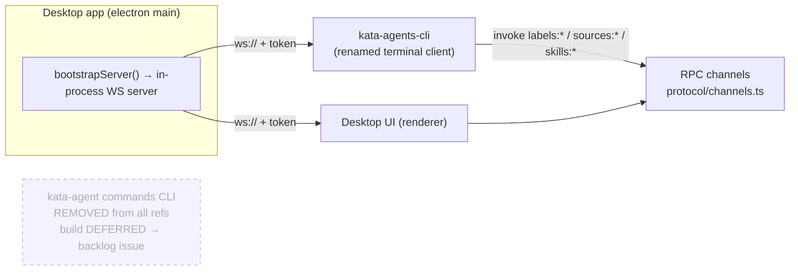

# Rename CLI and remove phantom kata-agent commands references

## Goal

Rename the WebSocket terminal client (`apps/cli`) from package `@kata-sh/cli` / binary `kata-cli` to package `@kata-sh/agents-cli` / binary `kata-agents-cli`, and remove every phantom reference to the never-implemented `kata-agent` workspace-commands binary across the system prompt, permission policies, bundled docs, and orphaned environment variables.

After this change, everything shipped in the repo is truthful: the only CLI/server binaries are `kata-agents-cli` (terminal client) and `kata-server`. The in-app agent is no longer instructed to call a binary that does not exist. Building a first-class `kata-agent` commands CLI is deferred to a backlog issue.

## Source of truth and verified current state

- **CLI A (`apps/cli`)** is the WebSocket terminal client. Package `@kata-sh/cli`, bin `kata-cli`. Commands: `ping`, `health`, `versions`, `workspaces`, `sessions`, `connections`, `sources`, `session create/messages/delete`, `send` (streaming), `cancel`, `invoke`, `listen`, `run` (self-contained, spawns a server via `apps/cli/src/server-spawner.ts`), and `--validate-server`. ~2,075 lines in `apps/cli/src/index.ts`.
- **CLI B (phantom `kata-agent`)** is referenced but does not exist as code. Verified across this repo and the upstream `/Volumes/EVO/repos/craft-agents-oss`:
  - No `package.json` declares a `kata-agent` (or upstream `craft-agent`) bin.
  - No file parses `label`/`source`/`skill`/`automation` as top-level CLI subcommands.
  - Upstream `apps/electron/src/main/index.ts:172-175` sets the same phantom env vars (`CRAFT_COMMANDS_ENTRY` → `packages/craft-agents-commands/src/main.ts`, `CRAFT_CLI_ENTRY` → `packages/craft-cli/src/cli.ts`); neither package exists upstream either.
  - The real capability is **RPC channels** in `packages/shared/src/protocol/channels.ts` (`labels:list`, `labels:create`, `sources:create`, `skills:get`, etc.), invoked today via CLI A's `invoke` command or the desktop UI.
- **System prompt instructs the agent to call the phantom:** `packages/shared/src/prompts/system.ts:590-601` — *"Prefer `kata-agent` CLI over direct file edits… `kata-agent label --help`…"*.
- **Permission policies encode the phantom:** `packages/shared/src/config/cli-domains.ts` sets `helpCommand: 'kata-agent <domain> --help'` across `label`, `source`, `skill`, `automation`, `permission`, `theme`; `packages/shared/src/config/sync-kata-agent-bash-patterns.ts` derives patterns from it; `packages/shared/tests/permissions-kata-agent-sync.test.ts` asserts the sync.
- **Bundled docs describe the phantom:** `apps/electron/resources/docs/kata-cli.md` opens *"`kata-agent` is the preferred interface for managing workspace config domains"* with full `kata-agent label/source/skill/automation` command listings. The domain docs (`labels.md`, `sources.md`, `skills.md`, `automations.md`, `permissions.md`) link to it as "Canonical command reference".
- **Orphaned env vars:** `apps/electron/src/main/index.ts:172-181` sets `KATA_COMMANDS_ENTRY`, `KATA_CLI_ENTRY`, `KATA_COMMANDS_DOC_PATH`, `KATA_CLI_DOC_PATH` pointing at `packages/kata-agents-commands` and `packages/kata-cli`, neither of which exists. Carried forward from `CRAFT_*` by the brand transition without verification.
- **Release workflow:** `.github/workflows/release.yml` `publish_cli` job is `if: false` with a stale comment citing "Project B" and "after the scope/env rename" as the reason for deferral. The rename is now complete (verify report 2026-06-23, all 12 ACs pass) and Project A/C/D was superseded by the single complete-brand-transition plan, so the comment is inaccurate.
- **Desktop app architecture:** `apps/electron/src/main/index.ts:627` bootstraps an in-process WS server via `bootstrapServer`. The CLI's `--url`/`--token` flags target an already-running server. This is the product loop the e2e demo validates.

## Constraints

- Runtime: Bun. Type-check via per-package `tsc --noEmit` (root `typecheck:all` is broken on base SHA per `AGENTS.md`).
- Surgical changes only: no refactor of CLI behavior, no new command surface, no npm publishing enablement.
- Prior brand-transition specs/build reports/verify reports are historical record and are **not** edited to scrub `kata-cli` mentions (excluded from the grep AC).
- `uat-evidence/` and generated `apps/electron/dist/`, `apps/electron/release/` artifacts are excluded from grep ACs.
- The `kata-agent` *assistant product* name (in-app identity, navigation events like `kata-agent-navigate`) is unrelated to the phantom CLI binary and is **not** touched.

## Out of scope

- Building the `kata-agent` workspace-commands CLI from scratch — deferred, tracked via backlog issue.
- Enabling `publish_cli` / npm publishing — separate product decision.
- Changing the CLI command surface or `run`/`send`/`validate-server` behavior.
- `kata-server` binary (already correctly named).

## Architecture

No new components. The change is identity, documentation, and dead-reference removal.

The renamed CLI and the desktop UI are peers against the same server RPC channels. The phantom `kata-agent` (dashed) is removed from all references; the deferred issue captures building it.

## Components and file groups

1. **Package identity** — `apps/cli/package.json` (`name` → `@kata-sh/agents-cli`, `bin.kata-cli` → `bin.kata-agents-cli`); `apps/cli/src/index.ts:1379` hardcoded `description: "Validation skill created by kata-cli"` string.
2. **CLI help/usage text** — `apps/cli/src/index.ts`: header comment (`:3`), help string (`:1894` `kata-cli — Terminal client for Kata Agent server`), usage line (`:1896`), example invocations (`:1939-1953`); residual `craft-kb`/`craft-public` example source names (`:1940-1941`).
3. **Reference docs** — `docs/reference/cli.md` (~40 `kata-cli` invocations, title, frontmatter), `docs/reference/index.md` entry, `README.md` (~7 invocations).
4. **Bundled doc** — rename `apps/electron/resources/docs/kata-cli.md` → `kata-agents-cli.md`; update `packages/shared/src/docs/index.ts` `kataCli` key and `${APP_ROOT}/docs/kata-cli.md` path; rewrite content to document CLI A's real `invoke`-based label/source/skill/automation access (e.g. `kata-agents-cli invoke labels:list`) with no `kata-agent` binary references.
5. **Domain docs** — `labels.md`, `sources.md`, `skills.md`, `automations.md`, `permissions.md`: replace the "Canonical command reference: [kata-cli.md]" line with a link to `kata-agents-cli.md` invoke guidance (or remove the false-canonical framing).
6. **System prompt** — `packages/shared/src/prompts/system.ts:590-601`: remove "Prefer `kata-agent` CLI" and the four `kata-agent <domain> --help` lines; replace with guidance to use `kata-agents-cli invoke <channel>` (e.g. `invoke labels:list`, `invoke sources:create`) or the desktop UI for label/source/skill/automation management.
7. **Permission policies** — `packages/shared/src/config/cli-domains.ts`: replace `helpCommand: 'kata-agent <domain> --help'` with the `kata-agents-cli invoke` equivalent across all 6 domains; update `packages/shared/src/config/sync-kata-agent-bash-patterns.ts` derived patterns; update or remove `packages/shared/tests/permissions-kata-agent-sync.test.ts` to assert the new truth.
8. **Orphaned env vars** — `apps/electron/src/main/index.ts:172-181`: delete `KATA_COMMANDS_ENTRY`, `KATA_CLI_ENTRY`, `KATA_COMMANDS_DOC_PATH`, `KATA_CLI_DOC_PATH` and their `packages/kata-cli` / `packages/kata-agents-commands` path targets.
9. **Release workflow** — `.github/workflows/release.yml` `publish_cli`: fix the stale "Project B / after the scope/env rename" comment to state publishing is deferred pending a product decision; update the disabled `echo` to reference `@kata-sh/agents-cli`.
10. **Release notes** — append to `apps/electron/resources/release-notes/next.md`: Improvements bullet for the rename; Breaking Changes bullet that the `kata-cli` binary is now `kata-agents-cli` and `kata-agent` commands-CLI references have been removed pending a future build.

## Implementation phases

1. **Package + CLI source rename** (components 1–2). Verify: `bun run apps/cli/src/index.ts --help` shows `kata-agents-cli`; no `kata-cli` or `craft` strings in help/usage/example output.
2. **Reference docs + README** (component 3). Verify: targeted grep clean in `docs/reference/` and `README.md`.
3. **Bundled doc rename + rewrite, domain docs** (components 4–5). Verify: `cd packages/shared && bun test` passes; doc lookup resolves the new filename.
4. **System prompt + policies + env-var removal** (components 6–8). Verify: `cd packages/shared && bun test` passes; no `kata-agent` CLI binary references remain in `prompts/` or `config/`.
5. **Workflow comment + release notes** (components 9–10).
6. **E2e demo + gate** (criterion 10–12): run the desktop app + CLI demo, capture UAT evidence, run type-check/test gates.

## Sequencing

Phases 1–5 are sequential; each builds on prior grep/test cleanliness. Phase 6 runs after all code/docs land. The deferred-work backlog issue is created after the spec is approved (separate from the build phases).

## Verification and testing

- **Grep gate:** `grep -rn "kata-cli" apps/ docs/ packages/ scripts/ .github/ README.md` (excluding `node_modules/`, `dist/`, `release/`, `uat-evidence/`, and prior `docs/specs/*brand-transition*` / `docs/specs/*ci-release-pipeline*` / `docs/adrs/2026-06-22-kata-identity-hard-cutover.md` historical records) returns zero matches.
- **Phantom grep gate:** `grep -rn "kata-agent CLI\|kata-agent label\|kata-agent source\|kata-agent skill\|kata-agent automation\|kata-agent permission\|kata-agent theme" packages/ apps/` (excluding tests/dist/release) returns zero matches.
- **Env-var grep gate:** `grep -rn "KATA_COMMANDS_ENTRY\|KATA_CLI_ENTRY\|KATA_COMMANDS_DOC_PATH\|KATA_CLI_DOC_PATH\|packages/kata-cli\|packages/kata-agents-commands" .` (excluding node_modules/dist/release) returns zero matches.
- **Unit/integration:** `cd apps/cli && bun run tsc --noEmit`; `cd apps/cli && bun test`; `cd packages/shared && bun test`.
- **CLI smoke:** `bun run apps/cli/src/index.ts --help` and `--version`.
- **E2e demo:** criterion 10, captured as UAT evidence.

## Risks and mitigations

- **`permissions-kata-agent-sync` test breaks** — expected. Rewrite it to assert `kata-agents-cli invoke` patterns; if the sync logic no longer has a meaningful invariant, remove the test with a rationale note in the spec's build report. Verify with `bun test`.
- **Bundled doc lookup by old filename** — `packages/shared/src/docs/index.ts` `kataCli` key and path must change together; any code reading the file by a hardcoded `kata-cli.md` string must be found via grep and updated in the same phase.
- **Breaking change for `kata-cli` users** — anyone who `bun link`-ed `kata-cli` must re-link as `kata-agents-cli`. Covered by the release-notes Breaking Changes bullet. No migration tooling provided (pre-1.0, small user base).
- **Over-removing `kata-agent` (product name)** — the product/assistant name `kata-agent` (e.g. `kata-agent-navigate`, recent-working-dirs playground paths) is unrelated and must not be touched. The phantom grep targets CLI-command forms (`kata-agent label`, `kata-agent source`, etc.) specifically, not the bare product name.

## Key files

- `apps/cli/package.json`
- `apps/cli/src/index.ts`
- `apps/cli/src/server-spawner.ts` (comment only)
- `docs/reference/cli.md`, `docs/reference/index.md`
- `README.md`
- `apps/electron/resources/docs/kata-cli.md` (rename → `kata-agents-cli.md`)
- `apps/electron/resources/docs/{labels,sources,skills,automations,permissions}.md`
- `packages/shared/src/docs/index.ts`
- `packages/shared/src/prompts/system.ts`
- `packages/shared/src/config/cli-domains.ts`
- `packages/shared/src/config/sync-kata-agent-bash-patterns.ts`
- `packages/shared/tests/permissions-kata-agent-sync.test.ts`
- `apps/electron/src/main/index.ts`
- `.github/workflows/release.yml`
- `apps/electron/resources/release-notes/next.md`

## Explicitly deferred work

- **Build the `kata-agent` workspace-commands CLI from scratch** — a real binary wrapping the RPC channels (`label`, `source`, `skill`, `automation`, `permission`, `theme` subcommands) so `kata-agent label list` etc. work without the generic `invoke` form. Tracked via backlog issue. Not a port from upstream (upstream has the same phantom).
- **Enable `publish_cli` / npm publishing** of `@kata-sh/agents-cli` — separate product decision; requires `NPM_TOKEN` and dist-tag policy.

## Build handoff

**Approved scope:** rename CLI A to `@kata-sh/agents-cli` / `kata-agents-cli`; remove all phantom `kata-agent` CLI references (system prompt, cli-domains, sync patterns, test, bundled doc, domain docs, orphaned env vars); fix the `publish_cli` comment; update release notes.

**Non-goals:** build the commands CLI; enable npm publishing; change CLI behavior; touch the `kata-agent` product name.

**Ordered phases:** 1 package+source → 2 reference docs+README → 3 bundled doc+domain docs → 4 prompt+policies+env vars → 5 workflow+release notes → 6 e2e demo+gates.

**Required verification:** grep gates (above), `apps/cli` typecheck + tests, `packages/shared` tests, CLI smoke, e2e demo UAT evidence.

**Blocking questions:** none at spec time. Build should confirm whether `permissions-kata-agent-sync.test.ts` still has a meaningful invariant after the policy rewrite; if not, remove with rationale.

## Acceptance criteria

1. **Package renamed.** `apps/cli/package.json` `name` is `@kata-sh/agents-cli` and `bin` exposes `kata-agents-cli` → `src/index.ts`. No `@kata-sh/cli` package name remains in the repo.
2. **Binary name updated in CLI output.** `bun run apps/cli/src/index.ts --help` prints `kata-agents-cli` in the header and usage line, with zero `kata-cli` strings and zero `craft` strings in help/usage/example output.
3. **No `kata-cli` references remain in source or docs.** `grep -rn "kata-cli" apps/ docs/ packages/ scripts/ .github/ README.md` (excluding `node_modules/`, `dist/`, `release/`, `uat-evidence/`, and prior `docs/specs/*brand-transition*`, `docs/specs/2026-06-19-ci-release-pipeline*.md`, `docs/adrs/2026-06-22-kata-identity-hard-cutover.md` historical records) returns zero matches.
4. **Bundled doc renamed and rewritten.** `apps/electron/resources/docs/kata-cli.md` is renamed to `kata-agents-cli.md`; `packages/shared/src/docs/index.ts` `kataCli` key/path updated to the new filename; content documents CLI A's real `invoke`-based label/source/skill/automation access (e.g. `kata-agents-cli invoke labels:list`) with no `kata-agent` binary references.
5. **Phantom `kata-agent` CLI references removed.** `system.ts` no longer contains "Prefer `kata-agent` CLI" or `kata-agent label/skill/...` help lines; `cli-domains.ts` helpCommands and `sync-kata-agent-bash-patterns.ts` no longer reference the `kata-agent` binary; `permissions-kata-agent-sync.test.ts` is updated or removed to match the new truth. The agent prompt directs label/source/skill/automation management via `kata-agents-cli invoke <channel>` and/or the desktop UI, not a phantom binary.
6. **Orphaned env vars removed.** `apps/electron/src/main/index.ts` no longer sets `KATA_COMMANDS_ENTRY`, `KATA_CLI_ENTRY`, `KATA_COMMANDS_DOC_PATH`, or `KATA_CLI_DOC_PATH`; no references to `packages/kata-cli` or `packages/kata-agents-commands` remain anywhere in the repo (excluding node_modules/dist/release).
7. **Domain docs no longer claim a phantom canonical reference.** `labels.md`, `sources.md`, `skills.md`, `automations.md`, `permissions.md` no longer link to `kata-cli.md` as a "Canonical command reference" for a `kata-agent` binary; links updated to the renamed `kata-agents-cli.md` invoke guidance or removed.
8. **Release workflow comment is accurate.** The `publish_cli` job comment no longer references "Project B" or the completed rename as the blocker; it states publishing is deferred pending a product decision, and the disabled `echo` references `@kata-sh/agents-cli`.
9. **Deferred-work backlog issue created.** A GitHub issue (using `.github/ISSUE_TEMPLATE/deferred_work.yml`, or a filed issue if no such template exists) captures "Build the `kata-agent` workspace-commands CLI from scratch" with context: phantom references were removed, capability lives behind RPC channels in `protocol/channels.ts`, agent prompt now uses `kata-agents-cli invoke`, this is a from-scratch build not a port.
10. **End-to-end demo passes.** A demo proves the full product loop with the renamed binary, captured as UAT evidence (terminal transcript + screenshot/recording):
    a. Start the desktop app (`bun run electron:dev`), which bootstraps its in-process server; capture the server's `KATA_SERVER_URL` and `KATA_SERVER_TOKEN` from startup output.
    b. Run `kata-agents-cli --url <ws://...> --token <token> ping` against the desktop app's running server; observe a successful connectivity response (clientId + latency).
    c. Run `kata-agents-cli --url <ws://...> --token <token> workspaces` (or `sessions`) and confirm it returns data from the desktop app's server.
    d. Run `kata-agents-cli --url <ws://...> --token <token> session create --name "demo"`; confirm the new session appears in the running desktop app's UI (proving CLI ↔ shared server ↔ desktop app round-trip).
    e. Run `kata-agents-cli --url <ws://...> --token <token> invoke system:homeDir`; confirm a JSON response.
11. **Type-checks and tests green.** `cd apps/cli && bun run tsc --noEmit` passes; `cd apps/cli && bun test` passes; `cd packages/shared && bun test` passes (covering the updated/removed phantom-sync test).
12. **Release notes updated.** A bullet is appended to `apps/electron/resources/release-notes/next.md` under Improvements (rename) and Breaking Changes (`kata-cli` → `kata-agents-cli`; `kata-agent` commands-CLI references removed pending a future build), following the file's existing format.
