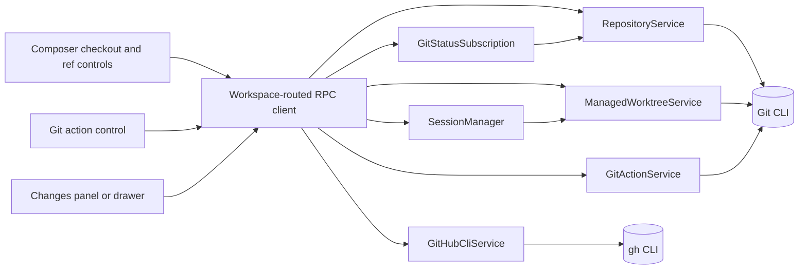

# Git and GitHub V1 with managed worktrees

## Status
Implemented and verified — all four phases are built behind
`KATA_FEATURE_GIT_WORKSPACE_V1` (off by default). The macOS `@git` tier now
contains an executable real-Electron/real-Git lifecycle flow, and visual
evidence for all four slices is checked in under
[`docs/validation/git-github-worktrees-v1/`](../validation/git-github-worktrees-v1/README.md).
The authenticated real-GitHub mutation pass remains an opt-in check for hosts
where `gh` is installed and authenticated; this verification pass exercised the
specified non-mutating missing-`gh` guidance instead. Build report:
[2026-07-26-git-github-worktrees-v1-build-report.md](2026-07-26-git-github-worktrees-v1-build-report.md).

## Goal

Give Kata Agents a user-facing Git workflow centered on safe parallel agent sessions:

1. Start a session in the current checkout or a new managed worktree.
2. Review the active checkout's complete uncommitted state in a Changes panel.
3. Send line-specific diff feedback to the active session.
4. Commit, push, and create or view a GitHub pull request without forcing a pull-request workflow.
5. Preserve and remove managed worktrees without silently losing work.

The feature must work for local and remote Kata workspaces. Git and GitHub commands run on the server that owns the workspace filesystem.

## Product framing

Kata Agents is an agent-session app with Git support. V1 provides the Git operations needed to isolate, review, and share agent work. It does not make Kata Agents a full Git client.

The primary user vocabulary is:

- **Current checkout**: use the selected working directory as it exists.
- **New worktree**: create a separate checkout and Kata-prefixed working branch for the session.
- **From `<ref>`**: choose the committed base for a new worktree.
- **Changes**: all uncommitted Git changes in the active checkout.
- **Conversation branch**: a provider-native fork of chat context. This is distinct from a Git branch.

Use `worktree` in the explicit Workspace choice because the Kata Code reference already establishes that term. Supporting copy should explain it as an isolated checkout.

## References

### Product references

- Kata Code Workspace selector and Git actions:
  - `/Volumes/EVO/dev/kata-code/apps/web/src/components/BranchToolbar.tsx`
  - `/Volumes/EVO/dev/kata-code/apps/web/src/components/BranchToolbarEnvModeSelector.tsx`
  - `/Volumes/EVO/dev/kata-code/apps/web/src/components/BranchToolbarBranchSelector.tsx`
  - `/Volumes/EVO/dev/kata-code/apps/web/src/components/GitActionsControl.tsx`
  - `/Volumes/EVO/dev/kata-code/apps/web/src/components/GitActionsControl.logic.ts`
  - `/Volumes/EVO/dev/kata-code/apps/web/src/components/DiffPanel.tsx`
  - `/Volumes/EVO/dev/kata-code/apps/server/src/vcs/GitVcsDriverCore.ts`
  - `/Volumes/EVO/dev/kata-code/apps/server/src/sourceControl/GitHubCli.ts`
- Kata Code visual reference: `/Users/gannonhall/Desktop/SCR-20260726-mrph.png`
- Orca Changes reference:
  - `/Volumes/EVO/repos/orca/src/renderer/src/components/right-sidebar/SourceControl.tsx`
  - `/Volumes/EVO/repos/orca/src/shared/git-status-types.ts`
  - `/Volumes/EVO/repos/orca/src/renderer/src/components/editor/ChangesModeView.tsx`
  - `/Volumes/EVO/repos/orca/src/main/git/status.ts`
  - `/Volumes/EVO/repos/orca/src/main/git/worktree.ts`

### External research

- [OpenAI Codex worktrees](https://developers.openai.com/codex/environments/git-worktrees): explicit Local/Worktree selection, managed worktrees, base-ref selection, handoff, `.worktreeinclude`, and cleanup.
- [OpenAI Codex code review](https://developers.openai.com/codex/code-review): active-repository review, file/hunk actions, inline feedback, and GitHub context through `gh`.
- [Claude Desktop](https://code.claude.com/docs/en/desktop): per-session worktrees, diff review, line comments, and pull-request status.
- [Claude Code worktrees](https://code.claude.com/docs/en/worktrees): worktree lifecycle, `.worktreeinclude`, resume behavior, and cleanup safety.

## Verified current state

Kata Agents currently has minimal branch display and no first-party Git workflow:

- `git:getBranch` is the only Git RPC channel. It runs `git rev-parse --abbrev-ref HEAD` and returns a string or `null`.
- The branch appears passively in the composer working-directory controls.
- There is no repository status, diff, worktree, commit, push, pull-request, or GitHub CLI service.
- New chat creates and persists an empty session immediately.
- `workingDirectory` is user-facing and mutable. `sdkCwd` is fixed once SDK context exists because provider transcripts are stored per CWD.
- An empty session may safely update `sdkCwd` only while it has no messages, no SDK session ID, and no live agent.
- Conversation branching is provider-native and requires the parent session's `sdkCwd` to find and fork provider context.
- Session file APIs show the Kata session folder, not the repository working directory.
- Route state already models a right-side panel, but `AppShell` currently disables the dedicated right-side chrome.
- `@pierre/diffs` and `ShikiDiffViewer` already provide unified and split syntax-highlighted diff rendering.
- RPC routing already sends remote-eligible operations to the workspace-owning server.
- Existing permission rules govern agent-issued `git` and `gh` shell commands. User-issued application actions are a separate control path.

Key current files:

- `packages/shared/src/protocol/channels.ts`
- `packages/shared/src/protocol/routing.ts`
- `packages/shared/src/protocol/dto.ts`
- `packages/shared/src/sessions/types.ts`
- `packages/shared/src/sessions/storage.ts`
- `packages/server-core/src/sessions/SessionManager.ts`
- `packages/server-core/src/handlers/rpc/system.ts`
- `apps/electron/src/main/handlers/system.ts`
- `apps/electron/src/renderer/components/app-shell/input/use-working-directory-state.ts`
- `apps/electron/src/renderer/components/app-shell/AppShell.tsx`
- `apps/electron/src/shared/types.ts`
- `apps/electron/src/shared/route-parser.ts`
- `packages/ui/src/components/code-viewer/ShikiDiffViewer.tsx`

## Scope

V1 includes four user-facing vertical slices:

1. **Start isolated**: checkout choice, base-ref selection, managed worktree creation, and session binding.
2. **Review changes**: live status, changed-file list, diff rendering, and batched line feedback.
3. **Share work**: state-driven commit, pull, push, and GitHub pull-request actions.
4. **Manage lifecycle**: local/remote parity, resume/recovery, shared ownership, and safe deletion.

The Build phase implements and verifies these slices in order. Each slice includes its protocol, server, persistence, renderer, tests, i18n, and user-facing error states. A phase must pass its phase-specific verification gate before Build starts the next phase.

V1 user-facing controls ship in the Electron desktop app. The remote-eligible server contracts support Electron clients connected to local or remote workspace owners. Dedicated WebUI and CLI interfaces are deferred.

## Out of scope

V1 does not include:

- stage, unstage, or discard controls in Changes
- per-hunk Git actions
- Git history or commit graph
- merge, rebase, force-push, or an in-app conflict editor
- GitLab or Bitbucket change-request integration
- built-in GitHub OAuth or token storage
- Codex-style handoff or apply-to-current-checkout
- automatic worktree removal on archive
- deleted-worktree snapshots or restoration
- independent managed worktrees for provider-native conversation branches
- non-Git version-control systems
- automatic copying of uncommitted changes from Current checkout into New worktree
- dedicated Git/worktree UI in WebUI or dedicated Git commands in `kata-agents-cli`

Deferred work is tracked in:

- [#16 Git V2: advanced source-control review and conflict workflows](https://github.com/gannonh/kata-agents/issues/16)
- [#17 Worktree V2: handoff, snapshots, auto-cleanup, and isolated conversation forks](https://github.com/gannonh/kata-agents/issues/17)
- [#18 Forge V2: additional code hosts, built-in auth, and non-Git VCS](https://github.com/gannonh/kata-agents/issues/18)
- [#19 Git V1 follow-up: WebUI and dedicated CLI parity](https://github.com/gannonh/kata-agents/issues/19)

## Acceptance criteria

### Slice 1: Start isolated

1. Before the first message in a Git repository, the composer shows a **Workspace** menu containing **Current checkout** and **New worktree**. Selecting New worktree reveals a separate searchable **From `<ref>`** control. Non-Git directories retain the existing working-directory experience and do not show unavailable Git controls.
2. **Current checkout** uses the selected directory and its current branch without creating or switching branches.
3. **New worktree** requires a base ref, defaults to the current branch, and creates a managed worktree plus a temporary `kata-agent/<8-hex>` working branch on the workspace-owning server. Uncommitted Current checkout changes are not copied, and the UI states that the worktree starts from committed state.
4. Worktree preparation completes before the first message is accepted. The session persists repository root, checkout path, base ref, expected branch, managed worktree ID, and ownership. Both `workingDirectory` and initial `sdkCwd` resolve to the worktree.
5. Checkout preparation is rejected unless the session has no messages, no SDK session ID, and no live agent. An unprepared New worktree/ref intent is renderer state until successful preparation; restarting before the first message restores the ordinary empty session in Current checkout with its working-directory state. New worktree/ref controls lock immediately after successful preparation, even if the subsequent send fails. Current checkout controls lock when the first message is accepted. Restart or resume after either lock point returns to the same checkout.
6. Two managed-worktree sessions from the same repository can modify the same source path without either checkout observing the other's uncommitted file content.
7. A repository may provide `.worktreeinclude` patterns for required gitignored regular files. Copying remains under the source repository, skips symlinks, never overwrites, and stops with a visible error above 10,000 files or 100 MiB total.
8. A provider-native conversation branch from a managed-worktree session shares the same managed worktree, is visibly labeled **Shared worktree**, adds an owner reference, and cannot trigger worktree removal while another owning session remains.

### Slice 2: Review changes

9. A **Changes** affordance shows changed-file count and additions/deletions for all uncommitted changes in the active checkout. App-issued Git actions refresh immediately; external Git changes appear within five seconds while a Git surface is visible.
10. The Changes panel identifies modified, added, deleted, renamed, and untracked files. Selecting a text file opens a unified or split diff. Binary files, files over 2 MiB, unavailable files, non-Git directories, and clean checkouts show explicit states.
11. Users can attach comments to old or new diff lines, review pending comments, and send them to the active session as one follow-up containing path, side, line, and context. Comments clear only after successful message submission. A changed diff marks affected comments stale and requires review before sending.

### Slice 3: Commit, push, and GitHub pull requests

12. A compact Git control implements the ordered normative resolver in **Git action control**. Its primary action can be Commit, Commit & push, Commit, push & PR, Push, Push & create PR, Create PR, Pull, View PR, or a disabled explanatory state. Its menu independently exposes each currently valid Commit, Push, and Create/View PR action. Resolver truth-table tests determine pass/fail.
13. Commit opens an editable message and file-selection flow, defaults to all changed files, commits only selected whole-file paths, and preserves unrelated staged entries. Renames are selected as an atomic old/new path pair. Push configures an upstream when needed. Pull is fast-forward-only. Default-branch mutations require explicit confirmation.
14. V1 never performs force-push, history/working-tree reset, rebase, merge, or automatic conflict resolution. The path-limited index reconciliation required by AC13 is permitted and does not change working-tree files or branch history. Diverged, conflicted, detached, or otherwise unsupported states remain inspectable and block unsafe actions with a suggested next step.
15. Pull-request actions appear for GitHub remotes only when `gh` is installed and authenticated on the workspace-owning machine. Create PR uses the managed worktree's persisted base ref when present, otherwise the repository's detected default ref, and presents editable title/body. View PR opens the detected pull request. Missing Git, remote, `gh`, or authentication produces actionable guidance without changing repository state.
16. Multi-stage actions report partial success. If commit succeeds and push or PR creation fails, the commit remains, status refreshes, and the next available action resumes from the completed stage.

### Slice 4: Lifecycle and parity

17. Local and remote workspaces expose the same controls. Git, worktree, and `gh` commands execute only on the workspace-owning server and stream structured progress and errors to the client.
18. Archiving a session preserves its managed worktree. Deleting a session presents session deletion and managed-worktree removal as separate choices. Current checkouts are never removed.
19. Managed-worktree removal is blocked while another session owns it. Uncommitted files or unpushed/unique commits require a specific destructive confirmation that names affected file and commit counts. The temporary branch is pruned only when it has no unique work.
20. App restart, server restart, reconnect, missing worktree, externally changed branch, and Git command failure each produce a visible recoverable or blocked state. No failure silently switches a session to another directory.
21. Automated verification covers Git parsing and path safety, worktree and session lifecycle, fixed `sdkCwd`, action-state resolution, selected-file commit behavior, line-comment serialization, local Electron flow, and a serial headless-server flow representing remote ownership. Manual UAT captures evidence for all four vertical slices, including an opt-in disposable real GitHub repository flow.

## Architecture

### Component map



### Ownership boundary

The server that owns the workspace filesystem owns all Git behavior. Renderer and CLI clients refer to a session or workspace plus typed operation input. Mutation handlers resolve the checkout path from persisted server state and never trust a client-provided mutation path.

All new Git/worktree/GitHub channels are remote-eligible. They execute through the existing routed client for local embedded and remote headless workspaces.

### Server services

Create a focused Git domain under `packages/server-core/src/git/` or `packages/server-core/src/services/git/`:

- **RepositoryService**
  - discover repository root and Git common directory
  - list local and remote refs
  - read branch/detached state, upstream, ahead/behind, default ref, remotes, and provider
  - parse machine-readable status
  - provide bounded file diffs and aggregate stats
- **ManagedWorktreeService**
  - generate Kata branch/worktree identity
  - create and validate managed worktrees
  - apply `.worktreeinclude`
  - track owners
  - inspect removal risk
  - remove worktree and safely prune an empty temporary branch
- **GitActionService**
  - commit selected files without including unrelated staged changes
  - fast-forward-only pull
  - push and configure upstream
  - report structured stages and partial success
- **GitHubCliService**
  - detect `gh` and authentication
  - resolve existing pull-request context
  - create a pull request
  - return URLs for client-side opening
- **GitStatusSubscription**
  - coalesce status work by checkout
  - poll at intervals no longer than three seconds while at least one Git surface is visible
  - refresh immediately after app Git actions and agent turn completion
  - publish workspace-routed status-change events so external changes render within the five-second acceptance bound

The current duplicate `git:getBranch` implementation in Electron and server-core should delegate to or be replaced by RepositoryService so branch identity has one implementation.

### Command execution

Use `execFile` or `spawn` with argument arrays. Do not construct shell command strings.

Each operation defines:

- timeout
- output-size limit
- accepted exit codes
- sanitized structured error mapping
- cancellation behavior
- repository lock requirements

Read-only status/diff operations may run concurrently. Mutations serialize by Git common directory so linked worktrees cannot concurrently modify shared Git metadata through Kata controls.

## Session and worktree model

### Session checkout metadata

Add a schema-versioned checkout record to persisted session metadata and protocol DTOs. Exact TypeScript placement should follow existing session/protocol conventions.

```text
SessionCheckoutV1
  schemaVersion: 1
  mode: current | managed-worktree
  repositoryRoot: absolute owner-host path
  checkoutPath: absolute owner-host path
  branchAtPreparation: string | null
  baseRef: string | null
  managedWorktreeId: string | null
  expectedBranch: string | null
  sharedOwnerCount: derived
```

`expectedBranch` is a validation expectation for managed worktrees. Live branch/status always comes from Git. Current checkout sessions do not assume the branch remains unchanged externally.

Existing sessions have no checkout record. They continue with current behavior and derive live Git context from `workingDirectory` when available. No migration creates worktrees automatically.

Host-specific managed-worktree IDs and paths are not portable. Session bundle/import and remote transfer must not recreate or claim ownership of a source-host worktree. Existing transfer behavior remains intact and clears managed-worktree ownership on the destination.

### Managed-worktree storage

Store worktree directories beneath the owning server's Kata config root, not inside the repository:

```text
<KATA_CONFIG_DIR>/worktrees/<workspace-id>/<repo-key>/<token>/
```

`repo-key` is the first 16 lowercase hex characters of SHA-256 over the normalized real Git common-directory path. `token` is eight lowercase hex characters from a cryptographically secure random source and is shared by the path and `kata-agent/<token>` branch. Creation checks both branch and path; a collision retries with a new token up to five times, then fails visibly.

Store the registry under the owning workspace's Kata config data. Each record contains:

- managed worktree ID
- repository root and Git common directory
- checkout path
- base ref
- expected branch
- creation time
- owner session IDs
- lifecycle state: preparing, ready, missing, removing, blocked

Registry writes are atomic. Startup reconciliation compares registry records, persisted session ownership, and `git worktree list --porcelain`. It repairs derivable owner references and marks ambiguous state blocked rather than deleting anything.

### Empty-session preparation gate

Keep immediate empty-session creation. Current checkout remains represented by the session's existing `workingDirectory` and live repository discovery. A selected New worktree/ref intent remains renderer state until checkout preparation succeeds. It is not persisted as a promised worktree on an unprepared empty session.

Changing `workingDirectory` or switching Workspace back to Current checkout before preparation clears any pending New worktree/ref intent and reruns repository/ref discovery for the active directory.

On first send from a session set to New worktree:

1. Renderer calls checkout preparation before sending the message.
2. SessionManager locks the session and verifies it has no messages, no SDK session ID, and no live agent.
3. RepositoryService resolves repository and base-ref identity.
4. ManagedWorktreeService creates a provisional registry record and runs `git worktree add -b kata-agent/<token> <path> <base-ref>`.
5. `.worktreeinclude` is applied.
6. Session persistence updates checkout metadata, `workingDirectory`, and `sdkCwd` atomically.
7. Registry state becomes ready.
8. Renderer sends the first message.

If steps 3 through 7 fail, the message is not accepted. A still-clean provisional worktree and branch are removed. Cleanup failure is reported and the registry record remains blocked for explicit recovery.

A second checkout-preparation request is idempotent only when its intent matches the persisted ready record. Any different intent is rejected.

### Conversation branches

Provider-native conversation branches preserve strict SDK fork behavior. A child from a managed-worktree session:

- inherits checkout metadata, `workingDirectory`, and the parent's required SDK CWD lineage
- adds its session ID as an owner of the same managed worktree
- shows Shared worktree identity in both sessions
- prevents worktree removal until the final owner is deleted

V1 does not claim filesystem isolation between those conversation branches.

Managed-worktree removal is offered only while deleting the final owning session. Kata does not intentionally remove a checkout while retaining a resumable owning session. If a worktree disappears externally, Kata's JSONL conversation remains available for inspection, but provider resume and further agent execution stay blocked until the recorded branch can recreate the checkout.

## Protocol and data flow

### Required protocol capabilities

The following capability set is normative. Build may choose channel names that match established protocol conventions, but it may not omit or merge away an independently authorized or independently testable capability:

- repository context and ref listing
- checkout status and bounded diff retrieval
- status subscribe/unsubscribe and push events
- empty-session checkout preparation
- managed-worktree risk inspection and removal
- commit, pull, and push with structured progress
- GitHub capability/auth status
- pull-request lookup and creation

Every channel must be classified in `packages/shared/src/protocol/routing.ts`; routing exhaustiveness tests remain green.

### Status model

Status must capture enough internal Git state to drive safe actions even when the UI stays simple:

- repository and checkout identity
- branch/detached state
- default ref and base ref
- upstream presence and upstream ahead/behind/divergence when configured
- `publishableCommitCount` for no-upstream first-push eligibility and `baseDeltaCount` for pull-request eligibility against the PR base/default ref
- primary remote and source-control provider
- open pull-request summary when available
- working-tree entries with path, previous path, type, index/worktree state, and conflict state
- additions/deletions totals when available
- operation-in-progress and blocked reason

Use NUL-delimited machine-readable Git output for paths. Do not parse localized human output.

### Changes panel data flow

1. Opening Changes subscribes to the active session checkout.
2. Server returns a status snapshot and starts coalesced polling for that checkout.
3. Selecting a listed path requests a bounded diff by session ID and path.
4. Server validates the path against the current status/repository before reading it.
5. Closing the final surface releases the subscription.

The panel shows complete active-checkout state. New managed worktrees make that state session-specific by construction. Current checkout may include pre-existing, user, tool, or other-process changes.

### Diff feedback

A pending comment stores:

- session ID
- repository-relative path
- old or new side, mapped to Pierre's `deletions` or `additions` annotation side
- line number
- comment text
- diff fingerprint
- short surrounding context

Pending comments are scoped to a session and survive panel close during the app run. Before send, the client refreshes affected diffs. Changed fingerprints mark comments stale.

The installed `@pierre/diffs` React API already exposes `lineAnnotations`, `renderAnnotation`, `renderHoverUtility`, and line-selection primitives in `node_modules/@pierre/diffs/dist/react/types.d.ts`. Phase 2 extends the existing wrapper through those supported primitives. If the installed API cannot provide stable old/new line identity in the real renderer, Build stops at the Phase 2 gate and returns to Plan rather than substituting an unanchored comment model.

Send serializes reviewed comments into one deterministic follow-up message. It uses the existing session message pipeline, queueing, permissions, and error behavior. No new provider-specific annotation format is required in V1.

## User interface

### Composer checkout controls

Before the first message in a Git repository:

- Workspace menu: Current checkout / New worktree
- Current checkout: live branch identity, no ref-switch action
- New worktree: searchable From `<ref>` picker
- default ref selection: current branch
- send state while preparing: Preparing worktree…

After managed-worktree preparation succeeds, replace mutable controls with checkout identity even if the subsequent message send fails. For Current checkout, lock the controls when the first message is accepted:

- Current checkout + live branch
- Worktree + expected/live branch
- Shared worktree when owner count exceeds one
- blocked/recovery badge when identity validation fails

### Changes surface

Add `changes` to right-panel route state. Activate right-side chrome for this surface in regular layouts and use a drawer at narrow widths. In multi-panel mode, the Changes panel and header Git control bind only to the focused session panel; changing focus updates both surfaces without leaking status or pending feedback between sessions.

The Changes surface contains:

- checkout identity and refresh state
- file count and additions/deletions
- flat changed-file list in V1
- file type/status indicator
- selected-file unified/split diff
- pending-feedback count
- Send feedback action
- explicit clean, non-Git, binary, oversized, missing, loading, and error states

V1 does not show staged/unstaged sections. Internal index state remains available to action safety logic.

### Git action control

The primary-action resolver and independent menu builder are normative local equivalents of Kata Code's `resolveQuickAction` and `buildMenuItems` in `/Volumes/EVO/dev/kata-code/apps/web/src/components/GitActionsControl.logic.ts`. The primary resolver is this ordered decision list; the first match wins:

1. Busy, missing status, non-Git, or missing branch/detached HEAD: disabled explanatory state.
2. Conflict or upstream divergence (`ahead > 0` and `behind > 0`): disabled explanatory state.
3. Configured upstream behind with a dirty working tree and not ahead: Commit, preserving work before external reconciliation.
4. Configured upstream behind with a clean working tree and not ahead: Pull using fast-forward-only behavior.
5. Dirty with no primary remote: Commit.
6. Dirty on the default branch or a branch with an open PR: Commit & push. Default-branch confirmation applies. Push creates upstream tracking when absent.
7. Dirty on a feature branch with a primary remote and no open PR: Commit, push & PR. Push creates upstream tracking before PR creation when absent.
8. Clean with no upstream, a primary remote, and publishable commits on the default branch or a branch with an open PR: Push and create upstream tracking. Default-branch confirmation applies.
9. Clean with no upstream, a primary remote, and publishable commits on a feature branch without an open PR: Push & create PR, creating upstream tracking first.
10. Clean and ahead of a configured upstream on the default branch or a branch with an open PR: Push. Default-branch confirmation applies.
11. Clean and ahead of a configured upstream on a feature branch with no open PR: Push & create PR.
12. Clean, not ahead of a configured upstream, ahead of the PR base/default ref, with a primary remote, and without an open PR: Create PR.
13. Clean with an open PR and no push/pull work: View PR.
14. Otherwise: disabled, up-to-date or setup-required explanatory state.

There is no Publish repository action in V1. Missing upstream is a visible setup state, not a global blocker: Pull is unavailable, while Push and Create PR remain valid when a primary remote exists and the branch has publishable commits. The adjacent menu independently enables Commit only for committable dirty state; Push when a primary remote exists and either configured-upstream ahead count or no-upstream publishable commit count is positive, with no behind/conflict state; Create PR when the clean branch has a base delta and no open PR, including the no-upstream case whose action pushes first; and View PR when an open PR exists. Pull is a primary action rather than a menu item. State resolution is a pure tested function.

Commit requires an editable message. Its initial value may use the session name, but users can replace it. PR title defaults to the latest commit subject, PR body defaults to the repository pull-request template when available or an empty string, and both remain editable. Model-generated commit or PR content is optional polish outside the V1 acceptance gate.

### Selected-file commit transaction

Selected-file commit behavior is normative because the Changes panel intentionally omits staging controls:

1. Capture the current HEAD and expand each selected rename into its old and new paths.
2. Create a secure temporary Git index and initialize it from HEAD with `git read-tree HEAD` under `GIT_INDEX_FILE`.
3. Stage only the expanded selected paths into the temporary index with `git add -A -- <paths>`.
4. Verify the temporary index has a non-empty cached diff, re-check that HEAD has not moved, and run normal commit hooks while committing that temporary index.
5. After commit success, verify HEAD equals the returned commit ID, then run `git reset -q <new-commit> -- <expanded-selected-paths>` against the real index with no `GIT_INDEX_FILE`. This resets only selected index entries to the new HEAD. Verify unrelated staged entries remain content-equivalent to their pre-operation snapshot.
6. Remove the temporary index on every exit path and refresh status.

Failure before commit leaves HEAD, the working tree, and the real index unchanged. If the path-limited real-index reconciliation fails after commit, retry it once; a second failure reports partial success with the commit ID and the explicit recovery command `git reset -q HEAD -- <expanded-selected-paths>`. Integration fixtures must cover an unrelated staged file, an unselected unstaged file, selected added/deleted/renamed files, and a selected file that had both staged and unstaged content.

## GitHub behavior

Git operations support any Git repository and remote that the installed Git client can use.

GitHub-specific actions require:

- detected GitHub remote
- `gh` installed on the workspace-owning machine
- `gh auth status` success for the relevant host

Kata does not store GitHub credentials. The UI provides direct setup guidance when capability checks fail.

Pull-request creation:

1. confirms the branch has an upstream or pushes it
2. resolves the PR base from the managed worktree's persisted base ref when present, otherwise from the repository's detected default ref, normalized to a branch name
3. presents editable title and body
4. invokes `gh pr create`
5. refreshes status and returns the PR URL

Existing PR lookup turns Create PR into View PR. PR lookup failure must not block commit or push.

## Safety and error handling

### Path and identity safety

- Mutation RPCs use session IDs and persisted checkout identity.
- Every mutation verifies repository root, Git common directory, checkout path, and expected managed branch.
- Worktree paths must remain under the configured Kata worktree root.
- Diff paths must be repository-relative members of the current status snapshot and pass existing path validation.
- `.worktreeinclude` uses Git ignore matching, `lstat`, and realpath containment checks.

### User actions and agent permissions

User-clicked application controls are explicit user authorization for the named Git operation and use their own confirmation rules. They do not depend on session permission mode.

Agent-issued Git and GitHub shell commands continue through existing safe/ask/allow-all permission enforcement. The Git status service reflects changes from either path.

### Partial success

Compound actions are ordered stages with structured results. Completed stages are never presented as rolled back.

Examples:

- commit succeeds, push fails: show commit success and push error; next action is Push
- push succeeds, PR creation fails: show pushed branch and PR error; next action is Create PR
- worktree is created, session update fails: attempt clean provisional cleanup; retain blocked registry state if cleanup fails

### Git state handling

Conflicted, diverged, detached, missing-upstream, missing-identity, and externally changed managed-branch states remain visible. The action resolver blocks only operations that V1 cannot perform safely and provides a next step. Missing upstream blocks Pull but allows first Push or Create PR when a primary remote and publishable commits exist; those actions configure upstream tracking.

## Feature flag and rollout

Gate the complete user-facing feature with `KATA_FEATURE_GIT_WORKSPACE_V1` and a shared `FEATURE_FLAGS.gitWorkspaceV1` accessor, following `packages/shared/src/feature-flags.ts`.

- The flag remains disabled by default in stable and nightly until all four slices pass Verify.
- Developers and explicit test runs enable the flag while building and verifying each slice.
- Server mutation handlers reject feature-only operations while the flag is disabled, so renderer/server state cannot drift.
- Existing `git:getBranch` display remains available while the flag is disabled.
- Removing the flag is follow-up cleanup after V1 stability, not part of the feature implementation gate.

## Implementation phases

### Phase 1: Start isolated

Deliver the complete first vertical slice:

- protocol DTOs, routing, and status/error envelopes needed by checkout preparation
- RepositoryService and ManagedWorktreeService foundations
- managed-worktree registry and startup reconciliation
- session checkout persistence and backwards-compatible JSONL parsing
- empty-session checkout preparation gate
- `.worktreeinclude` handling
- composer Workspace/ref controls and checkout identity
- conversation-branch shared ownership
- ADR for server-owned managed worktrees and SDK CWD binding
- unit, integration, renderer, and real-provider Electron tests for isolation

Likely files include:

- `packages/shared/src/protocol/{channels,routing,dto}.ts`
- `packages/shared/src/sessions/{types,storage,jsonl,bundle}.ts`
- `packages/server-core/src/sessions/SessionManager.ts`
- new `packages/server-core/src/git/` modules
- `packages/server-core/src/handlers/rpc/`
- `packages/shared/src/feature-flags.ts`
- `packages/server-core/src/handlers/rpc/system.ts`
- `apps/electron/src/main/handlers/system.ts`
- `apps/electron/src/transport/channel-map.ts` and channel/IPC tests
- `apps/electron/src/renderer/components/app-shell/input/`
- all seven locale files

### Phase 2: Review changes

Deliver the complete second vertical slice:

- status and diff protocol
- coalesced status subscription
- Changes route, desktop panel, and narrow drawer
- file list and aggregate stats
- ShikiDiffViewer line-comment extension
- pending/stale comment state and deterministic feedback serialization
- clean, non-Git, binary, oversized, missing, and error states
- renderer, server integration, and E2E coverage

Likely files include:

- new server Git status/diff modules
- `packages/shared/src/protocol/`
- `packages/ui/src/components/code-viewer/ShikiDiffViewer.tsx`
- `apps/electron/src/shared/{types,route-parser}.ts`
- `apps/electron/src/renderer/components/app-shell/AppShell.tsx` and its currently null `rightSidebarButton` integration
- new Changes components and hooks
- `e2e/src/config/tags.ts`
- all seven locale files

### Phase 3: Share work

Deliver the complete third vertical slice:

- pure Git action-state resolver
- GitActionService and structured progress
- selected-file commit preserving unrelated index state
- fast-forward pull, push, and upstream setup
- GitHubCliService and PR lookup/create
- adaptive header control and menus
- commit and pull-request dialogs
- partial-success states and default-branch confirmation
- integration tests across repository states
- opt-in disposable GitHub UAT

### Phase 4: Manage lifecycle

Deliver the complete fourth vertical slice:

- archive preservation and delete choices
- shared-owner cleanup rules
- uncommitted/unpushed/unique-work inspection
- temporary-branch pruning rules
- restart/reconnect/missing-worktree recovery
- local and headless-server parity
- full local and remote E2E
- packaged-app smoke and UAT evidence
- release notes and user documentation

## Verification plan

### Unit tests

- NUL-delimited status and ref parsing, including spaces and unusual path characters
- repository/remote/provider detection
- action-state resolver across clean, dirty, ahead, behind, diverged, detached, conflict, remote, configured-upstream, no-upstream first-push, base-delta, and PR combinations
- checkout intent validation and idempotence
- `.worktreeinclude` matching, containment, symlink, overwrite, count, and size limits
- diff-comment anchoring, stale detection, and serialization
- structured error mapping and log sanitization

### Server integration tests

Use real temporary Git repositories and the installed Git executable for:

- worktree creation from local and remote refs
- isolation between two worktrees
- `sdkCwd` binding before first agent creation
- registry reconciliation and shared ownership
- status and bounded diff behavior
- selected-file commit while an unrelated file is staged, another is unstaged but unselected, selected paths include added/deleted/renamed entries, and a selected file contains both staged and unstaged content
- fast-forward pull and divergence blocking
- push/upstream and partial success
- safe removal across clean, dirty, unique, pushed, shared, and missing states
- embedded and headless RPC routing

Use a controlled fake `gh` executable only for deterministic adapter tests. It must exercise argument construction, auth/capability mapping, output parsing, partial failure, and sanitization. It does not replace real GitHub UAT.

### Renderer and component tests

- pre-turn Workspace/ref selection and post-turn lock
- non-Git and error states
- checkout identity and Shared worktree label
- Changes summary, list, diff states, responsive drawer, and five-second refresh bound
- line-comment creation, stale state, batch send, and send failure retention
- adaptive Git action and menu states
- commit/PR forms, confirmations, progress, and partial success
- all user-facing strings through i18n with parity and sorting checks

### E2E and UAT

Add a serial `@git` tier using a real temporary repository and real Electron:

- Current checkout flow
- New worktree preparation before first provider turn
- agent edit isolation
- Changes review and feedback-to-revision loop
- commit and local Git state validation
- delete-time cleanup safety

Add a serial headless-server flow to represent remote filesystem ownership. Use the existing real-provider `@agent` tier for flows requiring agent edits.

Run opt-in GitHub UAT against a disposable repository when `gh` is authenticated:

- push new Kata branch
- create PR with expected base/title/body
- detect and open existing PR
- clean up PR, remote branch, local branch, worktree, and repository

Capture screenshots or video plus terminal/Git evidence for each acceptance criterion during Verify.

## Risks and mitigations

### Fixed SDK CWD

Risk: preparing a worktree after SDK context exists breaks provider transcript lookup and tool CWD consistency.

Mitigation: server-enforced empty-session preparation gate; bind both `workingDirectory` and `sdkCwd` before first message; block later mode changes.

### Shared Git metadata

Risk: linked worktrees share one Git common directory, so concurrent mutations can race.

Mitigation: serialize Kata-issued mutations by Git common directory; refresh all subscribed linked checkouts afterward.

### Conversation-branch isolation

Risk: provider-native conversation branches cannot also receive independent worktrees under the current SDK CWD contract.

Mitigation: share the parent checkout, display Shared worktree, track all owners, and defer independent isolation to [#17](https://github.com/gannonh/kata-agents/issues/17).

### Selected-file commits

Risk: naïve staging can include unrelated changes or destroy an existing staged selection.

Mitigation: use the specified temporary-index transaction, verify HEAD stability, reconcile only selected paths in the real index after success, and pass the required real-repository fixtures before exposing Commit.

### Remote ownership

Risk: local UI paths or tools may accidentally operate on a remote session's repository.

Mitigation: remote-eligible RPCs, session-ID mutation addressing, server-side identity resolution, and local/headless parity tests.

### Worktree disk usage

Risk: archive preserves worktrees and dependencies may consume substantial disk.

Mitigation: show managed-worktree identity and path in delete/recovery UI, expose explicit delete-time removal, and defer automatic cleanup/snapshots to [#17](https://github.com/gannonh/kata-agents/issues/17). Worktree removal is available only while deleting the final owning session; Kata never intentionally removes the checkout of a resumable retained session.

### GitHub tool availability

Risk: `gh` may be missing, unauthenticated, or authenticated for a different host.

Mitigation: capability checks and setup guidance; keep commit/push available independently; never store GitHub credentials.

## Documentation and release requirements

During Build:

- add an ADR covering server-owned managed worktrees, checkout persistence, shared owners, and fixed SDK CWD
- update `docs/architecture/system-overview.md`
- document user-facing Git/worktree behavior in `apps/online-docs/`
- document remote-server Git and `gh` requirements
- add release-note bullets to `apps/electron/resources/release-notes/next.md`
- update `docs/specs/index.md`, `docs/index.md`, and relevant `log.md` files after each substantial status change
- file any newly deferred work immediately through `.github/ISSUE_TEMPLATE/deferred_work.yml`

## Build handoff

Build starts only after this spec is explicitly approved and both status locations read Approved.

Build must:

1. Follow the four phases in order and keep each phase user-visible and independently verifiable. Record the phase verification result and stop before the next phase if any phase-specific test or acceptance criterion fails.
2. Use test-driven development for Git parsing, safety, session lifecycle, action resolution, and comment serialization.
3. Keep one server-side source of truth for Git behavior across Electron and headless modes.
4. Preserve existing sessions, conversation branching, working-directory selection, import/export, remote transfer, and permission behavior unless this spec explicitly changes them.
5. Stop rather than guess if real Git fixtures disprove selected-file preservation, SDK CWD binding, shared ownership, or remote routing assumptions.
6. Produce a Build completion report mapping implementation and tests to every acceptance criterion.
7. Enter Verify only after all implementation tests pass and no acceptance criterion remains partially implemented.
