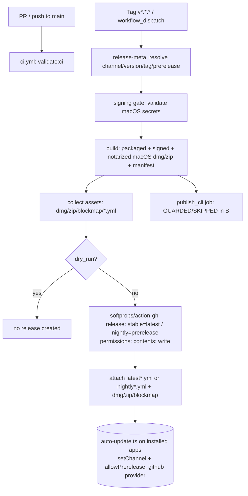

> **Completed before migration** (status: Completed). Retained as history. Not tracked in GitHub Issues.

# CI/Release Pipeline — Project B

## Status

- **Plan**: Approved (2026-06-19, user-approved after adversarial review).
- **Build**: Implemented (2026-06-19). See
  [build report](2026-06-19-ci-release-pipeline-build-report.md).
- **Verify**: Not started. AC1/AC3/AC5/AC6/AC9 require maintainer execution with
  configured repo secrets (see build report "Evidence" section).

## Goal

Stand up continuous integration and a desktop release pipeline for Kata Agents, driven through
GitHub Actions, matching the channel/auto-update shape of the kata-code project
(`/Volumes/EVO/dev/kata-code`). Stable and nightly channels publish to GitHub Releases; the desktop
auto-updater continues to work, pulling per-channel updates from those releases.

This is the second project in the post-fork roadmap (A brand tail → **B CI** → C safe code rename →
D identity infra). See [index.md](../index.md) for the roadmap and
[rebrand-kata-agents-phase-1.md](rebrand-kata-agents-phase-1.md) for prior context.

## Source of truth (reference implementation)

kata-code at `/Volumes/EVO/dev/kata-code`:

- `.github/workflows/ci.yml` — PR/push CI (check, test, browser test, release-smoke).
- `.github/workflows/release.yml` — version-tag + `workflow_dispatch` release (stable/nightly/dry-run),
  channel/meta resolution, signing gate, build matrix, asset collection, GitHub Release creation,
  npm CLI publish.
- `scripts/build-desktop-artifact.ts` — generates the electron-builder config including the
  `publish` block (the canonical auto-update shape, see below).
- `scripts/{resolve-nightly-release,resolve-previous-release-tag,update-release-package-versions,check-macos-release-signing,release-smoke}.ts`
  — supporting release scripts.
- `apps/desktop/src/updates/DesktopUpdates.ts` — runtime updater channel handling
  (`setChannel`, `allowPrerelease = channel === "nightly"`).

kata-code uses a different toolchain (`vp`/pnpm, scope `@kata-sh/*`, Clerk, a relay, mobile/EAS).
This spec ports the **structure and auto-update shape**, not the commands. All commands are retargeted
to kata-agents' Bun toolchain and existing scripts.

## Verified current state

- **No active workflows.** `.github/workflows/` does not exist. Two upstream workflows ship
  **disabled** under `.github/disabled/`:
  - `validate.yml` — PR/push to main; Bun `1.3.10`; `bun install --frozen-lockfile`; a
    Windows-illegal-filename guard; `bun run validate:ci`.
  - `validate-server.yml` — manual `workflow_dispatch`; 3-OS matrix; runs
    `apps/cli/src/index.ts --validate-server` with secrets `CRAFT_ANTHROPIC_API_KEY`, `STITCH_API_KEY`.
- **Validation gate** (`package.json`): `validate:ci` = `validate:dev`
  (`typecheck:all` + `test:shared:all` + `test:doc-tools`) + `lint:i18n:parity` + `lint:i18n:sorted`
  + `lint:i18n:coverage`. `AGENTS.md` flags `typecheck:all` (missing root `tsconfig.base.json`) and
  `lint:i18n:coverage` (missing `scripts/check-i18n-coverage.ts`) as potentially broken on the base
  SHA. **Actual green/red state must be established in Phase 1** before CI can claim to pass.
- **A working packaged-build path already exists; only some `package.json` script refs are dangling.**
  - Root `package.json` already has `electron:dist`, `electron:dist:mac`, `electron:dist:win`,
    `electron:dist:linux` (each: `electron:build` then `electron-builder --config electron-builder.yml --<plat>`).
  - `scripts/build/darwin.ts` exports `packageDarwin(config)` which runs `electron-builder --mac --<arch>`,
    sets `CSC_NAME` (stripping the "Developer ID Application: " prefix) and `NOTARIZE=true`.
  - `apps/electron/scripts/build-dmg.sh` already performs the full signed+notarized macOS build and
    outputs `Kata-Agents-${arch}.dmg`; `build-win.ps1` / `build-linux.sh` cover the other platforms.
  - **Dangling refs (do not exist; same bug class):** `scripts/build.ts` (`"build"`),
    `scripts/release.ts` (`"release"`), `scripts/check-version.ts` (`"check-version"`). These
    `package.json` entries point at missing files. Phase 2 wires them to the existing
    `electron:dist:*` / `build-dmg.sh` path or removes them — it does **not** author a new orchestrator.
  - `apps/electron/electron-builder.yml` — `appId: com.lukilabs.craft-agent`,
    `productName: Kata Agents`, `publish: { provider: generic, url: https://agents.craft.do/electron/latest }`,
    `mac` target builds `dmg` + `zip` for both `arm64` and `x64`, `hardenedRuntime: true`. The
    `notarize:` block is **commented out**; notarization is instead driven by `NOTARIZE=true` +
    `APPLE_*` env exported from `darwin.ts`/`build-dmg.sh`. electron-builder notarizes automatically
    when `APPLE_ID`/`APPLE_APP_SPECIFIC_PASSWORD`/`APPLE_TEAM_ID` are present, so the bare `NOTARIZE`
    export is effectively dead and one mechanism must be chosen in Phase 2.
- **Runtime updater has no channel concept.** `apps/electron/src/main/auto-update.ts` documents and
  assumes the **generic** provider served from `https://agents.craft.do/electron/latest`. It has no
  `setChannel`, no `allowPrerelease`, and no nightly/latest distinction. Switching to the `github`
  provider and supporting a nightly channel requires editing this file (see Phase 2b).
- **Missing typecheck/i18n infra (breaks `validate:ci`).** `tsconfig.base.json` is **missing** at the
  repo root, yet `packages/{session-tools-core,pi-agent-server,session-mcp-server}` `extends`
  `../../tsconfig.base.json` — so `typecheck:all` is broken until it is created.
  `scripts/check-i18n-coverage.ts` (used by `lint:i18n:coverage`) is also **missing**.
- **Signing assets available** in `/Volumes/EVO/dev/kata-code/.env`: `APPLE_SIGNING_IDENTITY`
  (Developer ID Application: Gannon Hall, team `ZBZKKWF95G`), `APPLE_ID`,
  `APPLE_APP_SPECIFIC_PASSWORD`, `APPLE_TEAM_ID`, `CSC_LINK` (base64 .p12), `CSC_KEY_PASSWORD`. These
  are macOS-only; no Windows code-signing certificate is available.
- **dependency check**: only `apps/server/package.json` is publishable (non-private). npm publishing
  is therefore narrow and is intentionally deferred (see Decisions).

## Auto-update shape (matches kata-code exactly)

electron-builder publish config (kata-code generates this; values shown are the target shape):

```js
publish: [{
  provider: "github",
  owner, repo,                                   // from GITHUB_REPOSITORY
  releaseType: nightly ? "prerelease" : "release",
  ...(nightly ? { channel: "nightly" } : {})     // stable omits channel → "latest"
}]
```

- **Provider `github`**: the bundled `app-update.yml` points the auto-updater at GitHub Releases.
- **Channel by version**: `X.Y.Z-nightly.YYYYMMDD.N` → `nightly`; anything else → `latest`.
- **Manifests**: nightly emits `nightly.yml` / `nightly-mac.yml`; stable emits `latest.yml` /
  `latest-mac.yml`. Both streams coexist in the same releases area.
- **Prerelease**: nightly releases are GitHub prereleases (`releaseType: "prerelease"`,
  `is_prerelease=true`, not "latest"); stable are full releases (`make_latest=true`).
- **Runtime** (`electron-updater`): set channel per installed build; `allowPrerelease = channel === "nightly"`;
  ignore versions that do not match the installed channel.
- kata-code differentiates the nightly product name ("Kata Code (Nightly)"). Kata Agents will mirror
  this as "Kata Agents (Nightly)".

**Release creation vs. the publish provider (do not conflate).** The `publish: { provider: github }`
block is **build-time only**: it governs the contents of the bundled `app-update.yml` and the
manifest filenames (`latest*.yml` / `nightly*.yml`). It does **not** upload the release. As in
kata-code, the workflow collects the built assets and creates the GitHub Release with an explicit
upload action (`softprops/action-gh-release@v2`), which is what controls prerelease/latest flags and
attaches assets. The Build agent must **not** rely on `electron-builder --publish always` (different
draft/prerelease semantics).

kata-agents differences to reconcile:
1. It uses a **static** `electron-builder.yml` with a `generic` provider. Project B switches the
   desktop **update feed** to the `github` provider with the nightly/latest channel + prerelease
   logic, injected per build (channel/prerelease values depend on the resolved version). The
   `agents.craft.do` URL is removed from the desktop update feed only; auth and all other usage are
   untouched.
2. Its runtime updater (`apps/electron/src/main/auto-update.ts`) has no channel handling. Project B
   adds `setChannel` + `allowPrerelease = channel === "nightly"` and channel-aware update filtering
   (Phase 2b), mirroring kata-code's `DesktopUpdates.ts`. Without this, a nightly install will not
   select `nightly.yml` over `latest.yml`.

## Decisions (from user)

1. **Distribution**: publish desktop artifacts + auto-update manifests to **GitHub Releases**
   (`github` provider), replacing the `agents.craft.do` generic feed.
2. **Nightly trigger**: **manual `workflow_dispatch` only** (`channel: nightly`), matching kata-code
   today. A scheduled cron is not wired in B; the "skip if no changes since last nightly" plumbing
   may be ported but stays dormant without a `schedule:` trigger.
3. **npm publishing**: **deferred**. A publish job is scaffolded but guarded/skipped so nothing is
   published to npm under the soon-renamed `@craft-agent/*` scope. Enabled in/after Project C.
4. **Build repair in scope**: B establishes a working packaged-build + release entry point and gets
   `validate:ci` green before building workflows on top.

## Platform assumption

- **macOS**: fully signed + notarized (Developer ID creds available). This is the primary release
  acceptance gate.
- **Windows / Linux**: build **unsigned** artifacts (best effort). Windows code-signing is **deferred**
  (no certificate available). If a Windows/Linux build proves non-trivial to green in CI, it may be
  reduced to a build-only (non-publishing) matrix leg and flagged as follow-up rather than blocking B.

## Out of scope

- npm publishing **enabled** (Project C).
- Package/scope rename `@craft-agent/*`, `CRAFT_*` env var rename (Project C).
- `appId`, `craftagents://` scheme, `~/.craft-agent` config dir + migration (Project D).
- `agents.craft.do` **auth/login** usage and viewer/publish domains (Project D). Only the desktop
  **update feed** moves to GitHub Releases in B.
- Windows code-signing, mobile/EAS, relay deploy, Clerk, marketing site (not present here).
- Scheduled (cron) nightly trigger.

## Acceptance criteria

1. `ci.yml` exists, triggers on `pull_request` and `push` to `main`, sets up Bun `1.3.10`, installs
   with `--frozen-lockfile`, runs the Windows-illegal-filename guard, and runs the validation suite.
   The workflow is **green** on a clean `main` (verify: a check run on a PR/commit shows success).
2. `bun run validate:ci` exits `0` locally and in CI, with **each** of its legs passing or explicitly
   descoped: `typecheck:all` (requires creating the missing root `tsconfig.base.json`),
   `test:shared:all`, `test:doc-tools` (python doc-tools deps resolve via `uv` in CI), `lint:i18n:parity`,
   `lint:i18n:sorted`, and `lint:i18n:coverage` (requires authoring the missing
   `scripts/check-i18n-coverage.ts`, or removing this single gate with recorded rationale). The build
   report documents the state of every leg and any removed gate (verify: command exits 0; CI log
   shows each leg; report enumerates them).
3. A single documented command produces **signed + notarized** macOS artifacts for the configured
   target set: `Kata-Agents-arm64.dmg` plus the `.zip` and `latest-mac.yml` that electron-updater
   consumes on macOS (and the `x64` equivalents unless the mac target is explicitly narrowed to arm64
   in the build report). Verify: run the command; the `.dmg`, `.zip`, and `*-mac.yml` exist;
   `codesign -dv --verbose=4` shows the Developer ID identity and `spctl -a -vvv -t install` /
   `xcrun stapler validate` pass on the `.app`/`.dmg`.
4. `release.yml` exists with triggers: push of tags matching `v*.*.*`, and `workflow_dispatch` with
   inputs `channel` (`stable` | `nightly`) and `dry_run` (boolean). A `dry_run` dispatch runs the
   build + sign steps to completion and creates **no** GitHub Release and publishes nothing (verify:
   dispatch dry-run; run is green; no release/tag created; no npm publish).
5. A **stable** release run produces a GitHub Release whose assets include the macOS installer(s) and
   a `latest.yml` / `latest-mac.yml` update manifest; the release has `is_prerelease=false` and is
   marked latest (verify: release page shows assets + `latest*.yml`, not a prerelease).
6. A **nightly** release run produces a GitHub **prerelease** tagged
   `v<version>-nightly.<YYYYMMDD>.<N>` whose assets include a `nightly.yml` / `nightly-mac.yml`
   manifest; `is_prerelease=true` and it is **not** marked latest (verify: release page shows
   prerelease + `nightly*.yml`).
7. The electron-builder publish config resolves to `provider: github` with `releaseType` and
   `channel` set per the auto-update shape above (build-time only); release creation/asset upload is
   done by an explicit action (`softprops/action-gh-release@v2`), not `electron-builder --publish`;
   the `agents.craft.do` generic URL no longer serves as the desktop update feed (verify: config/diff
   inspection + the manifest is attached to the release + `app-update.yml` in a built app references
   GitHub).
8. The runtime updater (`apps/electron/src/main/auto-update.ts`) sets the update channel and
   `allowPrerelease = channel === "nightly"`, and ignores versions that do not match the installed
   channel (verify: code inspection shows `setChannel`/`allowPrerelease`; AC 6's nightly install
   resolves the `nightly.yml` manifest, not `latest.yml`).
9. The `release.yml` release job declares `permissions: contents: write` (the default `GITHUB_TOKEN`
   is not assumed to be writable); verify: job-level `permissions` block present and a non-dry-run run
   creates a release successfully.
10. An npm publish job exists in `release.yml` but is **skipped/guarded**; no package is published to
    npm during B (verify: workflow run shows the publish job skipped; nothing new on npm for the
    workspace packages).
11. A `docs/` operations guide enumerates every required GitHub repository secret with its source and
    setup steps, including `CSC_LINK`, `CSC_KEY_PASSWORD`, `APPLE_ID`, `APPLE_APP_SPECIFIC_PASSWORD`,
    `APPLE_TEAM_ID`, `APPLE_SIGNING_IDENTITY`, and `GITHUB_TOKEN` (verify: the doc exists and lists
    each secret).
12. The change set introduces **no identity-infra changes beyond the desktop update feed**: `appId`,
    `craftagents://`, `~/.craft-agent`, `@craft-agent/*` scopes, `CRAFT_*` env vars, and
    `agents.craft.do` **auth** usage are unchanged. Files expected to change: CI workflows, the
    dangling build/release script refs, `apps/electron/electron-builder.yml` (`publish` block),
    `apps/electron/src/main/auto-update.ts` (provider + channel), release helper scripts, root
    `tsconfig.base.json`, and docs (verify: `git diff` is confined to these surfaces).

### Evidence when a live release cannot be produced

AC 5, 6, 7, and 9 require a real signed build and configured repo secrets that may be unavailable in
the Build agent's environment. Acceptable substitute evidence: (a) a `dry_run` dispatch that builds +
signs and inspects the generated assets/manifests locally; (b) a fixture release produced in a scratch
repository; or (c) a documented manual run by the maintainer. The build report must state which form
of evidence was used for each of these criteria.

## Architecture



## Implementation phases

### Phase 1 — Green CI baseline
- Triage `validate:ci` leg by leg. Required fixes: create the missing root `tsconfig.base.json` so
  `typecheck:all` resolves; confirm `test:doc-tools` python deps install via `uv` in CI. For
  `lint:i18n:coverage`, author the missing `scripts/check-i18n-coverage.ts`; if that cannot be done
  within this phase, remove only that single gate from the chain with recorded rationale (do not drop
  `typecheck:all` or the tests).
- Adapt `.github/disabled/validate.yml` → `.github/workflows/ci.yml`: keep Bun `1.3.10`, frozen
  install, Windows-illegal-filename guard, `concurrency` cancel-in-progress. Optionally split into
  `check` / `test` jobs to mirror kata-code's structure. Bump `actions/checkout` if appropriate.
- Re-enable `validate-server.yml` as a manual integration workflow (keep secret names as-is;
  renaming GitHub secret keys is infra/Project D, not B).
- Acceptance tie-in: AC 1, AC 2.

### Phase 2 — Build entry-point repair + release config
- **Wire the dangling script refs to existing tooling** — do not author a new orchestrator. Point
  `package.json` `"build"`/`"release"`/`"check-version"` at the existing `electron:dist:*` /
  `build-dmg.sh` path (or remove the dead entries). The signed+notarized macOS build already works
  via `build-dmg.sh` / `packageDarwin()`.
- **Pick one notarization mechanism.** electron-builder notarizes automatically from
  `APPLE_ID`/`APPLE_APP_SPECIFIC_PASSWORD`/`APPLE_TEAM_ID`; remove the dead `NOTARIZE=true` export (or
  switch fully to the config `notarize:` block). Do not leave both half-wired.
- **Release-config generation** (mirroring kata-code's `build-desktop-artifact.ts`): inject the
  `github` publish provider, `releaseType` (prerelease for nightly), `channel`
  (`nightly`/omit→latest), and the "Kata Agents (Nightly)" product name based on the resolved
  version/channel. This governs `app-update.yml` + manifest names only; it does not upload.
- Acceptance tie-in: AC 3, AC 7.

### Phase 2b — Runtime updater channel support
- Edit `apps/electron/src/main/auto-update.ts`: switch from the hardcoded generic feed to the
  `github` provider, add `setChannel(channel)` and `allowPrerelease = channel === "nightly"`, and
  ignore versions whose channel does not match the installed channel (mirror kata-code's
  `DesktopUpdates.ts`). Update the stale docstring that names `agents.craft.do`.
- Acceptance tie-in: AC 8 (and makes AC 6 actually function).

### Phase 3 — Release workflow
- Author `.github/workflows/release.yml`:
  - Triggers: `push` tags `v*.*.*`; `workflow_dispatch` inputs `channel`, `dry_run`.
  - `release_meta` job: resolve `release_channel`, `version`, `tag`, `is_prerelease`, `make_latest`,
    `cli_dist_tag`. Port + retarget kata-code's `resolve-nightly-release.ts` and
    `resolve-previous-release-tag.ts` to Bun (nightly version format `X.Y.Z-nightly.YYYYMMDD.N`).
  - `signing_gate` job: port `check-macos-release-signing.ts` to validate Apple secrets are present.
  - `build` job: macOS signed+notarized (required); Windows/Linux unsigned best-effort matrix legs.
  - `collect assets` + create the GitHub Release via `softprops/action-gh-release@v2` (stable →
    `make_latest`; nightly → `prerelease`) with manifests + installers attached. The release job
    declares `permissions: contents: write`. Honor `dry_run` (build/sign only, no release).
  - Port `update-release-package-versions.ts` (align workspace versions to the release version) to Bun.
- Acceptance tie-in: AC 4, AC 5, AC 6, AC 9.

### Phase 4 — npm publish scaffold (disabled) + feed switch
- Add a `publish_cli` job guarded so it is skipped in B (e.g. `if: false` with a TODO referencing
  Project C, or gated on a condition that is never true under current scope).
- Confirm `electron-builder.yml` no longer uses the `agents.craft.do` generic provider for desktop
  updates (the github provider config from Phase 2 governs).
- Acceptance tie-in: AC 7, AC 10, AC 12.

### Phase 5 — Docs + roadmap
- Add `docs/operations/` (new section) with `ci.md` and `release.md`: triggers, channel model,
  auto-update shape, dry-run usage, and a complete required-secrets table with setup steps.
- Update `docs/index.md`, `docs/specs/index.md`, and section/log files; record the four-project
  roadmap (A→B→C→D) in the specs roadmap.
- Acceptance tie-in: AC 11.

## Sequencing

Phase 1 → 2 → 2b → 3 → 4 → 5 in order; Phase 1 is independently mergeable (CI only) and can land
first if desired. Phases 2/2b/3/4 are tightly coupled (build config → runtime updater → release →
publish) and should land together. Phase 5 docs accompany whatever lands.

## Required GitHub secrets

| Secret | Purpose | Source |
| --- | --- | --- |
| `CSC_LINK` | Base64 .p12 signing cert | kata-code `.env` |
| `CSC_KEY_PASSWORD` | .p12 password | kata-code `.env` |
| `APPLE_ID` | Notarization Apple ID | kata-code `.env` |
| `APPLE_APP_SPECIFIC_PASSWORD` | Notarization app-specific password | kata-code `.env` |
| `APPLE_TEAM_ID` | Apple Developer team ID | kata-code `.env` |
| `APPLE_SIGNING_IDENTITY` | Developer ID Application identity | kata-code `.env` |
| `GITHUB_TOKEN` | Create releases, upload assets | GitHub Actions default (verify `contents: write`) |
| `CRAFT_ANTHROPIC_API_KEY`, `STITCH_API_KEY` | Integration `validate-server.yml` (optional) | existing |

## Risks and mitigations

- **`validate:ci` red on base SHA.** Mitigation: Phase 1 triages each gate first; CI is not declared
  done until green (AC 2). Removing a gate requires recorded rationale.
- **Dangling script refs, not a missing build path.** A working signed+notarized build already
  exists (`build-dmg.sh` / `packageDarwin()` / `electron:dist:*`); only `build.ts`/`release.ts`/
  `check-version.ts` refs dangle. Mitigation: Phase 2 wires/removes those refs rather than
  reinventing the build, avoiding wasted/duplicate work.
- **Nightly auto-update requires runtime channel logic that does not exist yet.** `auto-update.ts`
  has no `setChannel`/`allowPrerelease`; with the `github` provider a nightly install would otherwise
  follow `latest.yml`. Mitigation: Phase 2b ports kata-code's runtime channel handling; verify AC 6 +
  AC 8 (a nightly install resolves `nightly.yml`).
- **Release upload mechanism confusion.** `electron-builder --publish` has different draft/prerelease
  semantics than an explicit upload. Mitigation: AC 7 requires `softprops/action-gh-release`; the
  github provider is build-time-only.
- **`validate:ci` depends on missing infra.** `tsconfig.base.json` and `check-i18n-coverage.ts` are
  absent. Mitigation (bounded in Phase 1): create `tsconfig.base.json`; author or, as a last resort,
  drop only the `lint:i18n:coverage` gate with rationale.
- **No existing released Kata users on this feed.** The fork's appId is still Craft's; existing
  Craft Agents installs update from Craft's server, not this pipeline, so switching the desktop feed
  to GitHub Releases has no auto-update-continuity impact for real users. Noted, not blocking.
- **Notarization flakiness/time.** Notarization can be slow or rate-limited. Mitigation: keep it on
  the macOS leg only; allow dry-run to validate the path without publishing.
- **Windows/Linux green-in-CI cost.** Mitigation: reduce to build-only or defer as follow-up if
  non-trivial (Platform assumption).

## Verification

- **Commands**: `bun run validate:ci` with each leg passing (AC 2); documented build command +
  `codesign`/`spctl`/`stapler` over dmg/zip/manifest (AC 3).
- **CI**: a PR/commit shows `ci.yml` green (AC 1).
- **Release**: a `dry_run` dispatch (AC 4); a `stable` dispatch/tag producing a latest release (AC 5);
  a `nightly` dispatch producing a prerelease (AC 6); inspect release assets/manifests + upload action
  + `contents: write` (AC 7, AC 9); code inspection of runtime channel handling (AC 8). Use the
  substitute-evidence forms above where a live release is not possible.
- **npm**: confirm publish job skipped and nothing published (AC 10).
- **Docs/diff**: secrets guide present (AC 11); `git diff` scoped to the allowlisted surfaces (AC 12).

## Build handoff

- **Approved scope**: CI workflows (Bun), packaged-build/release entry-point repair, nightly/stable
  `release.yml` publishing to GitHub Releases with the kata-code auto-update shape, npm publish
  scaffolded-disabled, ops docs.
- **Non-goals**: scope/env rename, identity-infra (appId/scheme/config-dir/auth domains), enabled npm
  publish, Windows signing, cron nightly.
- **Ordered phases**: 1 baseline → 2 build config repair → 2b runtime updater channel → 3 release
  workflow → 4 publish scaffold/feed → 5 docs.
- **Required verification**: AC 1–12 above.
- **Blocking questions**: none open. Platform breadth (Win/Linux build-only vs full) may be decided
  during Phase 3 based on CI cost.
