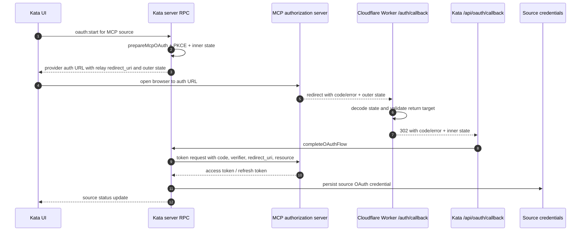
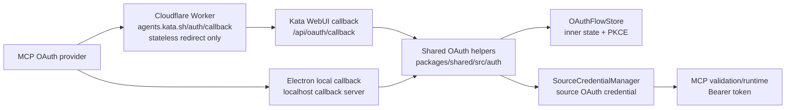

> **Completed before migration** (status: Completed). Retained as history. Not tracked in GitHub Issues.

# MCP OAuth callback support

## Status
Implemented

## Goal

Enable HTTP MCP sources with `mcp.authType: "oauth"` to complete OAuth from Kata Agents without landing on `404: NOT_FOUND` at `https://agents.kata.sh/auth/callback`.

Done means a user can add an OAuth-protected remote MCP source, start authentication from the auth card or source test path, approve in the browser, return through the callback path, persist source credentials, and then successfully call the source's MCP tools.

The Plan MCP connector used to draft the original visual plan is not part of this product work.

## Source of truth and verified current state

- The app can create an MCP source and render a source OAuth auth card, but the browser redirects to `https://agents.kata.sh/auth/callback?...` and receives a Vercel `DEPLOYMENT_NOT_FOUND` 404.
- `packages/shared/src/auth/oauth-relay.ts` already defines the stable relay URI as `https://agents.kata.sh/auth/callback` and implements the relay state envelope:
  - outer state prefix: `ca1.`
  - envelope fields: `v` version, `r` return target, `s` inner OAuth state
  - helpers: `encodeOAuthRelayState`, `decodeOAuthRelayState`, `wrapPreparedOAuthFlowForRelay`
- `packages/shared/src/sources/credential-manager.ts` already switches WebUI source OAuth into relay mode when `options.callbackUrl` is present, then wraps the prepared auth URL with the relay state envelope.
- `packages/server-core/src/webui/http-server.ts` already serves deployment-local `GET /api/oauth/callback` when OAuth callback dependencies are wired.
- `packages/server-core/src/handlers/rpc/oauth.ts` calls `completeOAuthFlow`, which exchanges the authorization code, stores source credentials, completes pending auth cards, and pushes source updates.
- `packages/server/src/index.ts` wires `webuiHandler.setOAuthCallbackDeps(...)`, so the WebUI callback route has the dependencies needed for token exchange.
- `apps/electron/src/preload/bootstrap.ts` already has a local callback-server path for Electron OAuth flows.
- `packages/shared/src/auth/oauth.ts` has `prepareMcpOAuth`, `exchangeMcpOAuth`, `discoverOAuthMetadata`, and MCP token exchange plumbing, but the planned work must ensure MCP authorization and token requests include the MCP `resource` parameter.
- `packages/shared/src/mcp/validation.ts` validates MCP connections and accepts `mcpAccessToken` for authenticated validation.
- Existing tests relevant to this work include:
  - `packages/shared/src/auth/__tests__/oauth.test.ts`
  - `packages/shared/src/auth/__tests__/oauth-relay.test.ts`
  - `packages/shared/src/sources/__tests__/oauth-relay.test.ts`
  - `packages/server-core/src/webui/__tests__/oauth-callback.test.ts`

## Resolved decisions

- The public callback relay will be a small Cloudflare Worker on the Cloudflare-managed `kata.sh` domain.
- The worker must stay free-tier friendly: stateless, no Durable Objects, no KV, no database, no token storage, and no token exchange.
- Cloudflare should route only the callback path needed for OAuth. The existing Vercel marketing site should remain untouched.
- The first return-target policy allows hosted Kata WebUI origins plus localhost/loopback development callbacks.
- Token exchange and credential storage remain server-side in the existing Kata server callback/completion path.

## Constraints

- Runtime: Bun.
- Keep secret handling in `packages/shared/src/credentials/` and existing credential manager paths. Do not store OAuth tokens in the Cloudflare Worker.
- Keep the relay stateless and free-tier friendly.
- Use existing OAuth flow store and source credential manager paths where possible.
- Preserve Electron localhost OAuth behavior.
- Preserve WebUI `/api/oauth/callback` as the deployment-local token exchange endpoint.
- User-facing strings added during implementation must go through i18n if they appear in the UI.
- Add or update release notes for user-visible MCP OAuth support.

## Out of scope

- Stdio MCP OAuth. The MCP authorization spec guidance for stdio is credential retrieval from the local environment, not browser redirects.
- Paid Cloudflare products, persistent edge storage, or relay-side token exchange.
- Provider-specific OAuth dashboards beyond documented fallback guidance when dynamic client registration is unavailable.
- Replacing the source folder/config architecture.
- Replacing the existing `OAuthFlowStore` with shared durable storage. Multi-instance callback affinity can be handled in a later spec if needed.

## Architecture

The relay is only a browser redirect bridge. It decodes the outer relay state, validates the return target, and redirects the browser to the deployment-local callback endpoint with the provider query parameters and the inner state.



### Component boundaries



## Components and file groups

1. **Cloudflare Worker relay**
   - Add a small worker for `https://agents.kata.sh/auth/callback`.
   - The worker should decode the existing `ca1.` relay state envelope or share a compatible implementation with `packages/shared/src/auth/oauth-relay.ts`.
   - It forwards `code`, `error`, `error_description`, and other provider callback parameters to the validated `returnTo` URL while replacing outer state with the inner state.
   - It returns a controlled error for missing state, malformed state, unsupported state version, missing return target, or unsafe return target.

2. **Cloudflare routing**
   - Route only `/auth/callback` for the relevant host through the worker.
   - Keep existing marketing/docs/app routes with their current owners.
   - Keep configuration free-tier compatible.

3. **MCP OAuth resource indicator**
   - Update `packages/shared/src/auth/oauth.ts` so `prepareMcpOAuth` includes `resource` in authorization requests.
   - Update MCP token exchange so the token request includes the same `resource`.
   - Use the normalized configured MCP server URL as the resource value.

4. **WebUI callback completion**
   - Preserve `packages/server-core/src/webui/http-server.ts` and `packages/server-core/src/handlers/rpc/oauth.ts` as the token exchange and persistence owner.
   - Add failure coverage where the relay forwards provider errors to `/api/oauth/callback`.

5. **Source OAuth UX and validation**
   - Keep source auth card behavior and source test behavior aligned with `needs-auth`.
   - After credentials persist, re-test or refresh source status so the user can see that the MCP source is usable.

6. **Docs and release notes**
   - Document `mcp.authType: "oauth"`, the hosted callback requirement, Cloudflare Worker relay ownership, localhost/Electron behavior, and provider fallback guidance.
   - Append release notes under `apps/electron/resources/release-notes/next.md` if the implemented change is user-visible in the release.

## Data flow details

### Relay request

Input request:

```text
GET https://agents.kata.sh/auth/callback?code=<provider-code>&state=ca1.<outer-state>
```

Outer state envelope:

```json
{
  "v": 1,
  "r": "https://<kata-webui-origin>/api/oauth/callback",
  "s": "<inner-oauth-state>"
}
```

Output redirect:

```text
302 Location: https://<kata-webui-origin>/api/oauth/callback?code=<provider-code>&state=<inner-oauth-state>
```

Provider error redirect:

```text
302 Location: https://<kata-webui-origin>/api/oauth/callback?error=<error>&error_description=<description>&state=<inner-oauth-state>
```

### Return target policy

The first-cut allowlist is explicit configuration plus localhost development callbacks:

- hosted Kata WebUI origins listed in the worker's configured allowlist, for example `KATA_OAUTH_RELAY_ALLOWED_RETURN_ORIGINS=https://agents.kata.sh`
- `http://localhost:<port>/api/oauth/callback`
- `http://127.0.0.1:<port>/api/oauth/callback`

The hosted allowlist must use exact origins, not wildcards. Build must confirm the production and staging WebUI origins before deployment and add them to the worker config.

The worker must reject:

- non-HTTP(S) schemes
- unapproved HTTPS hosts
- localhost targets that do not use the expected callback path
- URLs with credentials in the authority component
- malformed URLs

### MCP resource canonicalization

The MCP `resource` value must be derived from the configured MCP source URL before OAuth discovery or redirects:

1. Parse `source.config.mcp.url` with `new URL(...)`.
2. Require `http:` or `https:`.
3. Lowercase the scheme and hostname through URL serialization.
4. Strip username, password, query, and hash.
5. Strip default ports (`:80` for HTTP, `:443` for HTTPS`) through URL serialization.
6. Preserve the path because MCP endpoints may live below the origin, such as `/mcp`.
7. Normalize a trailing slash only when the path is `/`; do not remove a meaningful endpoint path segment.
8. Do not follow redirects or replace the value with OAuth issuer metadata.

The same normalized resource string must be used in the authorization request and token request.

## Implementation phases

1. **Worker placement and route shape**
   - First confirm the Cloudflare Worker source/config owner for the Kata-managed domain. This is a Build prerequisite because the current repository inspection did not find an existing worker location for this callback.
   - Add the worker and route config for `agents.kata.sh/auth/callback` or the exact Cloudflare route needed for the hosted callback.
   - Configure exact hosted return origins through worker configuration, with localhost/loopback handled as a dev rule.
   - Keep the worker stateless and dependency-light.
   - Acceptance ties: 1, 2, 3, 4.

2. **Relay behavior and tests**
   - Implement state decode, return target validation, success redirect, provider-error redirect, and controlled error responses.
   - Add tests for valid relay, bad state, unsafe return target, and provider error forwarding.
   - Acceptance ties: 1, 2, 3, 4.

3. **MCP resource parameter**
   - Add `resource` to MCP authorization and token requests.
   - Add unit tests around auth URL construction and token request body.
   - Acceptance ties: 5.

4. **Callback completion and source status**
   - Verify WebUI `/api/oauth/callback` still calls `completeOAuthFlow` and persists source credentials.
   - Ensure provider errors produce a user-visible failure state rather than a silent failure.
   - Ensure post-auth source status refresh or source test reflects success.
   - Acceptance ties: 6, 7.

5. **Electron regression guard**
   - Verify Electron local callback behavior remains local and does not require the Cloudflare relay.
   - Acceptance ties: 8.

6. **Docs, release notes, and closeout**
   - Update user-facing docs and release notes.
   - Run targeted tests and manual smoke.
   - Acceptance ties: 9, 10, 11.

## Sequencing

Build the stateless relay and tests first because the visible failure is currently at the public callback URL. Add MCP `resource` handling before manual provider smoke, since a compliant provider may reject a request that omits it. Validate WebUI and Electron flows after the request shape and relay route are in place.

The Cloudflare Worker and shared OAuth updates can be implemented independently if two builders split the work, but final verification must exercise the complete browser flow.

## Verification and testing

Targeted commands and checks:

- `cd packages/shared && bun test src/auth/__tests__/oauth.test.ts src/auth/__tests__/oauth-relay.test.ts src/sources/__tests__/oauth-relay.test.ts`
- `bun test packages/server-core/src/webui/__tests__/oauth-callback.test.ts`
- Worker tests for relay redirect and allowlist behavior, using the worker test command added with the implementation.
- WebUI smoke with an OAuth-protected HTTP MCP source. Use a real provider such as Linear MCP when credentials are available; otherwise add and use a local OAuth-protected MCP fixture so the full callback and token-storage path still has pass/fail evidence.
- Manual Electron smoke confirming localhost callback still completes without the public relay.
- `bun run lint:i18n:parity` and `bun run lint:i18n:sorted` if UI strings are added or changed.

## Risks and mitigations

- **Open redirect risk:** the relay decodes a return URL from state. Mitigate with a strict allowlist for hosted Kata WebUI origins plus localhost/loopback callback paths.
- **Cloudflare/Vercel routing ambiguity:** `kata.sh` is Cloudflare-managed while the marketing site is on Vercel. Mitigate by routing only the callback path through the worker and leaving unrelated routes untouched.
- **Free-tier drift:** adding storage or token exchange at the edge would widen scope and cost. Mitigate by keeping the worker stateless and redirect-only.
- **Provider redirect registration:** providers without dynamic client registration may require a stable redirect URI. Mitigate by documenting `https://agents.kata.sh/auth/callback` as the callback URI.
- **MCP resource indicator compatibility:** adding `resource` changes the provider request shape. Mitigate with unit tests for both auth and token requests and a manual provider smoke.
- **In-memory flow store:** WebUI callback completion depends on the Kata server that created the flow retaining the inner state. Mitigate in this spec by redirecting to the exact `returnTo` callback encoded at flow creation. Handle multi-instance shared storage only if it becomes a demonstrated deployment requirement.

## Key files

Likely touched files or areas:

- Cloudflare Worker source/config location, identified by the Build prerequisite before deployment edits
- `packages/shared/src/auth/oauth-relay.ts`
- `packages/shared/src/auth/oauth.ts`
- `packages/shared/src/auth/__tests__/oauth.test.ts`
- `packages/shared/src/auth/__tests__/oauth-relay.test.ts`
- `packages/shared/src/sources/credential-manager.ts`
- `packages/shared/src/sources/__tests__/oauth-relay.test.ts`
- `packages/server-core/src/handlers/rpc/oauth.ts`
- `packages/server-core/src/webui/http-server.ts`
- `packages/server-core/src/webui/__tests__/oauth-callback.test.ts`
- `packages/shared/src/mcp/validation.ts`
- MCP source setup/auth UI files if source status messaging needs adjustment
- `apps/electron/resources/release-notes/next.md`
- docs covering MCP source configuration and OAuth callback setup

## Acceptance criteria

1. **Public callback route exists.** `https://agents.kata.sh/auth/callback` is served by a Cloudflare Worker route, not the Vercel marketing deployment, and a request with missing or malformed state returns a controlled non-404 error response.
2. **Relay success redirects correctly.** A valid relay callback request with `code` and a `ca1.` state envelope redirects to the encoded `returnTo` `/api/oauth/callback` URL with the provider `code` and the inner state.
3. **Relay provider errors forward correctly.** A valid relay callback request with `error`, optional `error_description`, and a `ca1.` state envelope redirects to the encoded `returnTo` `/api/oauth/callback` URL with the provider error fields and the inner state.
4. **Relay rejects unsafe return targets.** Tests prove the worker rejects malformed return targets, unapproved HTTPS hosts, non-HTTP(S) schemes, URLs with credentials, and localhost URLs that do not use the expected callback path.
5. **MCP resource parameter is present.** Tests prove MCP OAuth authorization URLs and token exchange requests include `resource` using the normalized configured MCP server URL, following the canonicalization rules in this spec.
6. **WebUI callback completes token storage.** A WebUI callback test or manual smoke proves `/api/oauth/callback` calls `completeOAuthFlow`, exchanges the authorization code, stores the source OAuth credential, and pushes a source status update.
7. **OAuth-protected MCP source becomes usable.** A smoke test with an OAuth-protected HTTP MCP source proves the user can authenticate in the browser, return to Kata Agents, and then list or call MCP tools using the stored token. Use a real provider when credentials are available; otherwise use a local OAuth-protected MCP fixture and record that real-provider credentials were unavailable.
8. **Electron local callback still works.** Manual or automated smoke proves Electron OAuth still uses the local callback server path and does not require the Cloudflare relay for local desktop flows.
9. **No relay-side token handling.** Code review and tests confirm the Cloudflare Worker does not store flow state, exchange authorization codes, persist tokens, or call credential APIs.
10. **Docs and release notes updated.** Documentation explains `mcp.authType: "oauth"`, the callback URI, hosted relay behavior, localhost/Electron behavior, and provider fallback guidance; release notes are updated if the change is user-visible.
11. **Targeted tests pass.** The targeted shared auth, source relay, server callback, and worker tests pass with the implementation.

## Build completion report

See [2026-06-26-mcp-oauth-callback-support-build-report.md](./2026-06-26-mcp-oauth-callback-support-build-report.md).

## Build handoff

**Approved scope after user approval:** add a stateless Cloudflare Worker relay for `https://agents.kata.sh/auth/callback`; route only the callback path through Cloudflare; validate hosted Kata WebUI plus localhost/loopback return targets; preserve existing server-side token exchange and credential storage; add MCP `resource` to authorization and token requests; add focused tests; update docs and release notes.

**Non-goals:** paid Cloudflare storage/products, relay-side token exchange, stdio MCP OAuth, provider-specific dashboard automation, source architecture replacement, and shared durable OAuth flow storage.

**Ordered phases:** 1 worker placement and route shape → 2 relay behavior and tests → 3 MCP resource parameter → 4 callback completion and source status → 5 Electron regression guard → 6 docs/release notes/closeout.

**Required verification:** acceptance criteria 1-11, targeted test commands listed above, manual WebUI OAuth smoke, manual Electron local callback smoke, and i18n lint if UI strings change.

**Blocking prerequisite before Build edits:** confirm the exact Cloudflare Worker source/config location and the hosted production/staging WebUI origins that belong in the worker allowlist. Do not edit deployment routing until those owners and origins are identified.
