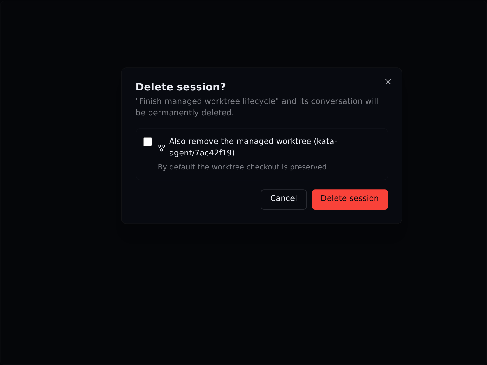
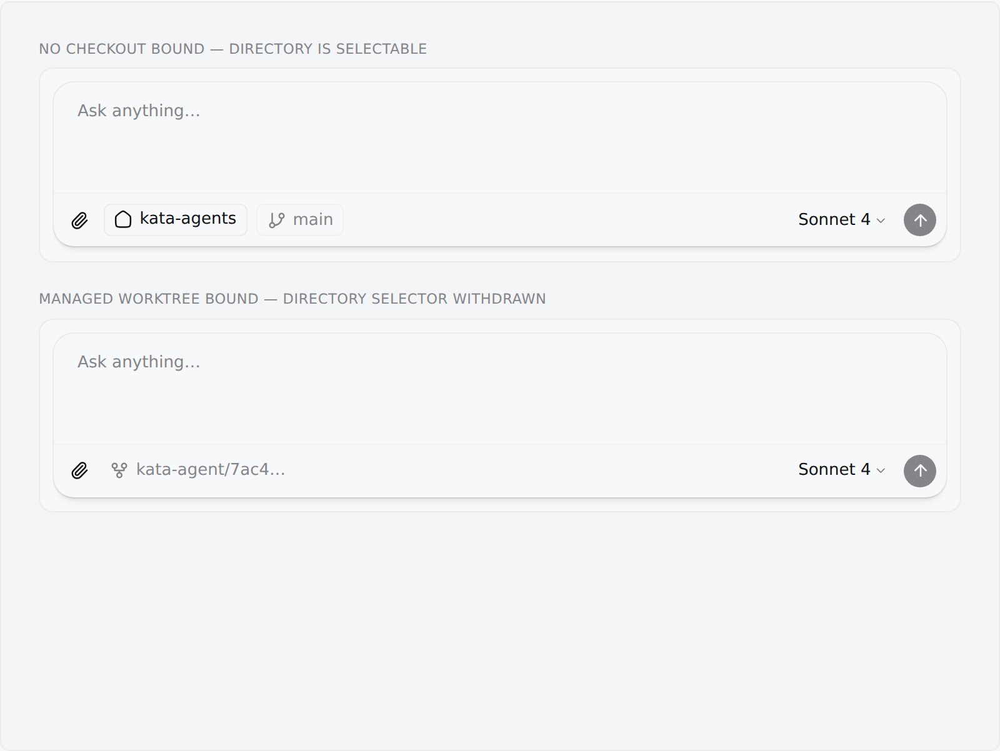

# Git and GitHub worktrees V1 — validation evidence

Captured from the production renderer components in the repository playground
with `KATA_FEATURE_GIT_WORKSPACE_V1=1`. The fixture drives the same checkout
control, composer, Changes panel, Git action control, and delete dialog used by
the Electron app.

Reproduce with:

```bash
bun run playground:dev   # → http://localhost:5173/playground.html
# Category "Git Workspace" → "Git Workspace acceptance" → pick a variant
```

The visual pass is paired with two real-Electron, real-Git tests. The local
`e2e/tests/git/managed-worktree.spec.ts` flow creates a disposable repository
with a non-GitHub remote, reviews an external file change, commits it, verifies
the repository state, and confirms destructive worktree removal. The
`e2e/tests/git/github-integration.spec.ts` flow clones the configured UAT
repository to a temporary workspace, commits, pushes, creates a real pull
request, and closes the pull request plus deletes its branch during cleanup.
Both harnesses intentionally remain macOS-only and fail loud on unsupported
hosts.

## Vertical slices

### 1. Start isolated


### 2. Review changes


### 3. Share work


### 4. Manage lifecycle

Managed-worktree removal is a separate choice from deleting the session, and a
removal that would discard work names the counts first.


Default state (removal not chosen — the checkout is preserved), dark theme:



### 5. A bound checkout owns the working directory

Two real composers. The unbound session can still pick a working directory; the
session bound to a managed worktree shows its locked checkout identity instead,
because Git actions, the Changes surface, and `sdkCwd` all resolve from the
persisted checkout. `SessionManager.updateWorkingDirectory` rejects the change
server-side as well, so no entry point can split "where the agent edits" from
"what Kata inspects and commits".



## Behavior that is verified by tests rather than screenshots

Most of the resolved review findings are invariants with no visual surface.
Each has real-repository coverage:

| Behavior | Test |
|---|---|
| Session deletion quiesces the agent, stages session storage reversibly, then strictly compares and removes under the Git lock while the runtime session exists | `packages/server-core/src/git/__tests__/lifecycle.test.ts` — "authoritatively removes the checkout while the session still exists", "session-storage staging failure", and "has no dry-run gap" |
| Startup recovery restores an interrupted pre-removal transaction and purges a completed transaction without rediscovering its session header | same file — "startup recovery restores" and "cannot resurrect a session" |
| A blocked removal changes nothing: session and checkout both survive | same file — "a blocked removal changes nothing at all" |
| Every removal guard can be evaluated without mutating anything | `packages/server-core/src/git/__tests__/remove-worktree-safety.test.ts` — "dry run" |
| Status omits staged changes the working tree has reverted, keeps working-tree mode changes, and keeps entries on an unborn branch | `packages/server-core/src/git/__tests__/repository-service.test.ts` — "HEAD→working-tree consistency" |
| A selected file named with pathspec magic cannot stage unrelated files | `packages/server-core/src/git/__tests__/action-service.test.ts` — "literal pathspecs" |
| A prepared-but-empty session still gets the managed-worktree confirmation | `apps/electron/src/renderer/components/app-shell/__tests__/worktree-removal.test.ts` — `resolveDeleteConfirmation` |
| A bound checkout rejects working-directory changes | `packages/server-core/src/git/__tests__/lifecycle.test.ts` — "bound checkouts are authoritative" |
| Unattended deletion cleans up an unused worktree, and keeps both session and checkout when it holds work | `packages/server-core/src/git/__tests__/lifecycle.test.ts` — "removeManagedWorktree is safe for any caller" |
| Removal waits for the turn to unwind (not the backend flag, which `forceAbort` clears immediately) and refuses rather than racing a turn that never finishes | `packages/server-core/src/git/__tests__/lifecycle.test.ts` — "removal waits for real agent quiescence" and "the backend flag alone cannot wave removal through" |
| Reconciliation reclaims unowned clean checkouts and retains unowned ones holding work | `packages/server-core/src/git/__tests__/reconcile.test.ts` — "reclaiming leaked (unowned) checkouts" |
| A destructive confirmation authorizes only the exact HEAD, index, file modes, working-tree content, and commits displayed; added, removed, same-count substitutions and identity drift are refused | `packages/server-core/src/git/__tests__/lifecycle.test.ts` — "server-owned removal ordering" and "a destructive confirmation is not blanket authorization" |
| A removal that fails keeps its registry record, so the checkout stays discoverable instead of leaking silently | `packages/server-core/src/git/__tests__/remove-worktree-cleanup-failure.test.ts` |
| Status-inspection failure and an owner added during inspection both fail closed | `packages/server-core/src/git/__tests__/remove-worktree-safety.test.ts` — "fails closed" and "rechecks ownership" |

## Automated coverage

- `packages/server-core/src/handlers/rpc/headless-server-flow.test.ts`: real
  repository/server lifecycle and session-addressed removal.
- `e2e/tests/git/managed-worktree.spec.ts`: real Electron/Git local vertical
  flow, including screenshot attachments when run on a macOS GUI host.
- `e2e/tests/git/github-integration.spec.ts`: authenticated real GitHub flow
  covering commit, push, pull-request creation, and cleanup of the temporary
  remote branch.
- `packages/server-core/src/git/__tests__/repository-service.test.ts`: PR title
  and body defaults from the latest commit subject and repository template.
- `apps/electron/src/renderer/atoms/__tests__/git-status.test.ts`: IPC status
  reaches the same provider-backed Jotai store rendered by Git surfaces.

## Host limitations

- The real Electron Playwright harness is macOS-only and requires a GUI
  session. The local and authenticated flows were run successfully on the
  supported macOS host.
- The authenticated flow requires `gh` and `KATA_E2E_GIT_REPO`. It clones the
  configured source checkout into a temporary directory, then closes the test
  pull request and deletes its remote branch during cleanup. Environments
  without authenticated `gh` can run the local non-GitHub flow; deterministic
  adapter/RPC tests cover the authenticated argument and failure paths.
