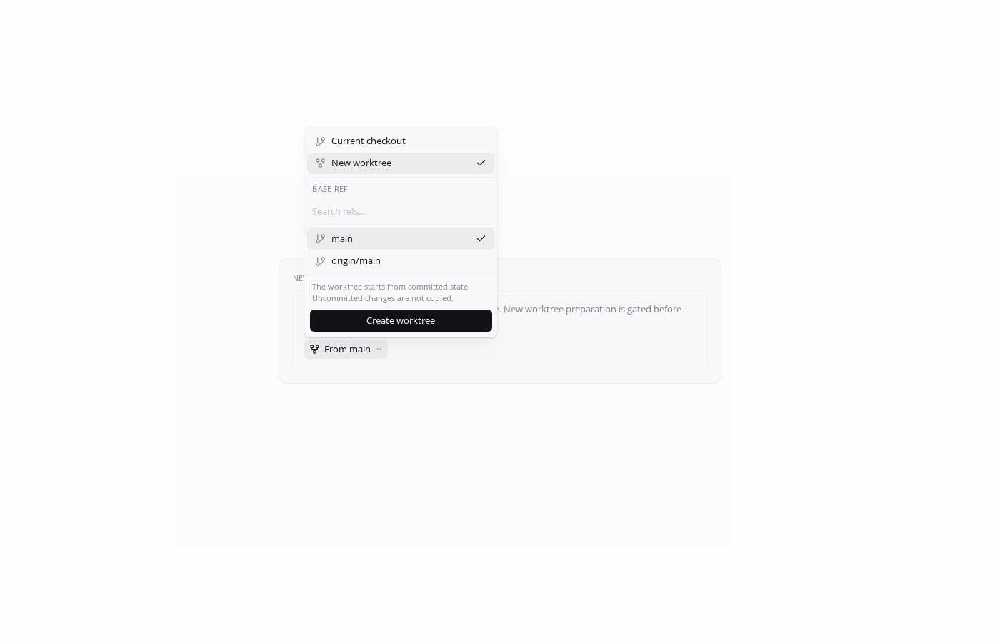
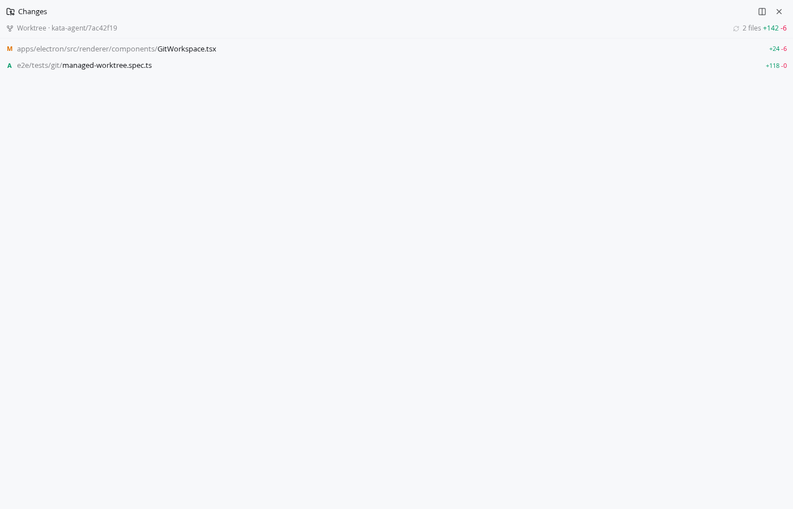
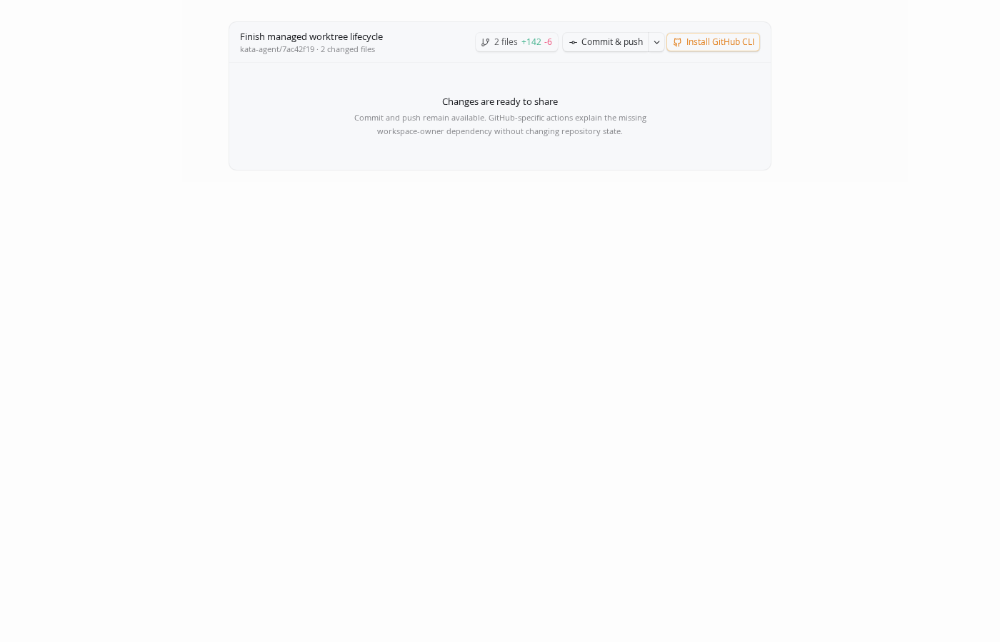
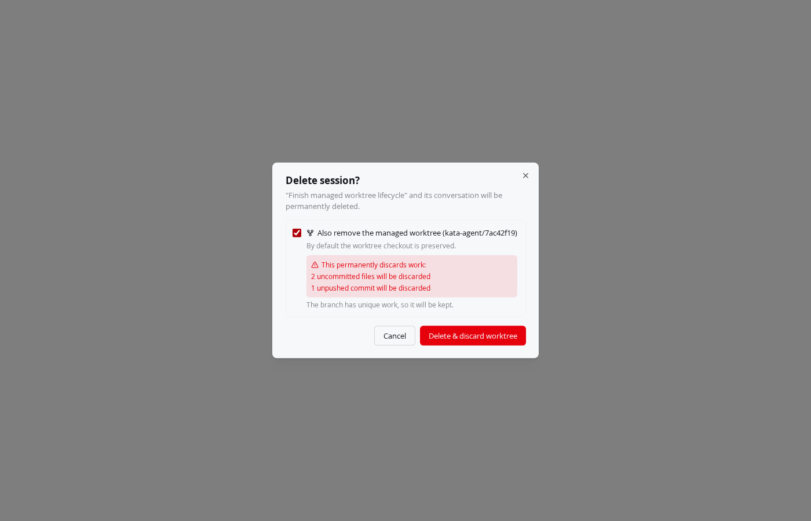

# Git and GitHub worktrees V1 — validation evidence

Captured 2026-07-29 from the production renderer components in the repository
playground with `KATA_FEATURE_GIT_WORKSPACE_V1=1`. The fixture drives the same
checkout control, Changes panel, Git action control, and delete dialog used by
the Electron app.

The visual pass is paired with
`e2e/tests/git/managed-worktree.spec.ts`, a real-Electron, real-Git test that
creates a disposable repository and managed worktree, reviews an external file
change, commits it, verifies the repository state, and confirms destructive
worktree removal. The E2E harness intentionally remains macOS-only and fails
loud on unsupported hosts.

## Vertical slices

### 1. Start isolated

### 2. Review changes

### 3. Share work

### 4. Manage lifecycle

## Automated coverage

- `packages/server-core/src/handlers/rpc/headless-server-flow.test.ts`: real
  repository/server lifecycle and session-addressed removal.
- `e2e/tests/git/managed-worktree.spec.ts`: real Electron/Git vertical flow,
  including four screenshot attachments when run on a macOS GUI host.
- `packages/server-core/src/git/__tests__/repository-service.test.ts`: PR title
  and body defaults from the latest commit subject and repository template.
- `apps/electron/src/renderer/atoms/__tests__/git-status.test.ts`: IPC status
  reaches the same provider-backed Jotai store rendered by Git surfaces.
